# All-in-one Rust Embedded Programming Manual for STM32F4 series
In this manual, we will cover all the pieces of knowledge we need to know for using `Rust` to do embedded programming.

And we pick the `ARM-based MCU STM32F4` series chips as our target to run all the demos.

All commands below are running on **macOS**. I will provide the link to **Windows** and **Linux** as well.

[**1. Important concepts**](#important-concepts)
- [_1.1 What is `MCU` and `Soc`? What makes it different than `SBC`?_](#what-is-mcu)
- [_1.2 What is `STM32`?_](#what-is-stm32)
- [_1.3 The hardware we will use in the demo_](#the-hardware-we-will-use-in-the-demo)
- [_1.3.1 STM32F407G-DISC1 dev board for running on the emulator_](#dev-board-for-running-on-emulator)
- [_1.3.2 WeAct Black Pill for running on the hardware_](#black-pill-for-running-on-hardware)

[**2. Setup Environment**](#setup-environment)
- [_2.1 Install tooling_](#install-tooling)
- [_2.2 Create a `demo` project from exists template_](#create-demo-project-from-template)
- [_2.3 Run hello example in `QEMU` and set a breakpoint in `ARM GDB`_](#run-hello-example-in-qemu)
- [_2.3.1 Run hello example in hardware_](#run-hello-example-in-hardware)
- [_2.3.2 Debugging in `vim` with the `ARM GDB`_](#debugging-in-vim-gdb)

[**3. How to choose which crate (rust's library) to start**](#how-to-choose-which-crate-to-start)
- [_3.1 The basic example_](#the-basic-example)
- [_3.2 The GPIO LED blinking example_](#the-gpio-led-example)

[**4. Something you need to know before we dive deep**](#something-you-need-to-know-before-we-dive-deep)
- [_4.1 About STM32F4 MCU registers_](#mcu-register)
- [_4.2 STM32F4 **GPIOP** registers_](#mcu-gpio-register)
- [_4.2.1 How to control **GPIO register**_](#how-to-control-gpio-register)
- [_4.2.1.1 How to enable the `GPIO` port `D`_](#how-to-enable-gpio-d)
- [_4.2.1.2 If you don't know the bitwise operation?_](#if-you-dont-know-the-bitwise-operation)
- [_4.2.1.3 How to configure the `GPIO` port `D` to **output** mode_](#how-to-configure-gpio-d-to-output-mode)
- [_4.2.1.4 How to set the `GPIO` port `D` (pin12 ~ pin15) to `High` or `Low`_](#how-to-toggle-gpiod-pin-voltage)
- [_4.3 Finally, Let's put all together: use raw GPIO register to control LED_](#use-raw-gpio-register-to-control-led)
- [_4.4 Let's fix the bug in release build_](#fix-the-bug-in-release-build)
- [_4.5 The fun part, code comparison_](#fun-part-code-comparison)
- [_4.6 For the rest of the chapters, we pick the low-level (pure register controlling) code style for all demos, why?_](#we-will-choose-low-level-code-style)

[**5. What is the `Clock` and how to use it**](#what-is-the-clock-and-how-to-use-it)

- [_5.1 Simple clock brief_](#simple-clock-brief)
- [_5.2 What is `clock source selecting`?_](#what-is-clock-source-selecting)
- [_5.3 What exactly the `Clock` is?_](#what-exactly-the-clock-is)
- [_5.4 What a professional `Clock tree diagram` looks like?_](#what-a-clock-tree-digram-looks-like)
- [_5.5 Let's dive deep into the `clock source selecting`_](#dive-deep-into-clock-source-selecting)
- [_5.6 Let's write some code to demonstrate system clock setting_](#write-code-for-system-clock-setting)

[**6. What is the `Interrupt` and how to use it**](#what-is-the-interrupt-and-how-to-use-it)

[**7. About optimizing the binary size**](#about-optimize-the-binary-size)

<hr>

## <a name="important-concepts">1. Important concepts</a>

#### <a name="what-is-mcu">1.1 What is `MCU` and `Soc`? What makes it different than `SBC`?</a>

- `MCU` stands for `Microcontroller Unit`.
- `Soc` stands for `System-on-chip`.
- `SBC` stands for `Single Board Computer`.

Summaries, `MCU` and `Soc` sound like the same thing which is an all-in-one chip. It includes all the hardware
components below inside the single-chip:

- CPU (even FPU)
- RAM (Random Access Memory)
- ROM (Read-only Memory)
- Flash (as the hard drive to store your program)
- Any related I/O

It's basically a very small computer on an `IC` (integrated circuit) or microchip. Compare to `SBC`, it got a few different below:

- `MCU` usually with limited hardware power resources which suit for non-heavy computation solution.
- `MCU` can deal with fast power on and off at any given time and won't hurt your program which `SBC` can't do like that (as it got 
`OS` on it).
- `MCU` doesn't have `OS` at all, your program will be the **only** one program running there with full control and real-time responsiveness.

#### <a name="what-is-stm32">1.2 What is `STM32`?</a>

`STM32` is a family of **32-bit** `MCU` by **STMicroelectronics**. The `STM32` chips are grouped into related series that are based around the same **32-bit** ARM processor core, such as:

- **Cortex-M33F**
- **Cortex-M7F**
- **Cortex-M4F**
- **Cortex-M3**
- **Cortex-M0+**
- **Cortex-M0**

The `F` means with `FPU` (Floating Point Unit).

Internally, each `MCU` consists of the processor core, static RAM, flash memory, debugging interface, and various peripherals.

The company behind the `Arm` trademark (`Arm Holdings`) doesn't actually manufacture chips for purchase. Instead, their primary business model is to just design parts of chips. They will then license those designs to manufacturers, who will in turn implement the designs (perhaps with some of their own tweaks) in the form of physical hardware that can then be sold.


### <a name="the-hardware-we-will-use-in-the-demo">1.3 The hardware we will use in the demo</a>

#### <a name="dev-board-for-running-on-emulator">1.3.1 STM32F407G-DISC1 dev board for running on the emulator</a>

- **STM32F407G-DISC1** (replaces **STM32F4DISCOVERY**) dev board which with the `STM32F407VG` high performance `MCU`. Here is the [user manual](./Discovery_kit_withlSTM32F407VG_MCU_user_manual.pdf).

- About the onboard `STM32F407VG` MCU:

    - High-performance foundation line, ARM **Cortex-M4** core with **DSP** and **FPU**, 1 Mbyte Flash, 168 MHz CPU, ART Accelerator, Ethernet, FSMC

    - More hardware details at [here](https://www.st.com/content/st_com/en/products/microcontrollers-microprocessors/stm32-32-bit-arm-cortex-mcus/stm32-high-performance-mcus/stm32f4-series/stm32f407-417/stm32f407vg.html),
[datasheet](./stm32f407vg-datasheet.pdf) and [reference manual](./stm32f4-reference-manual.pdf).


#### <a name="black-pill-for-running-on-hardware">1.3.2 WeAct Black Pill for running on the hardware</a>

- **WeAct Black Pill** board which with the `STM32F411CEU6` high performance `MCU`.

- About the onboard `STM32F411CEU6` MCU:

    - High-performance foundation line, ARM **Cortex-M4** core with **DSP**, **FPU** and **MPU**, 512 Kbytes Flash, 100 MHz CPU.

    - [Aliexpress link](https://www.aliexpress.com/item/1005001456186625.html)

    - [TaoBao link](https://item.taobao.com/item.htm?spm=a1z0d.6639537.1997196601.68.27457484mBxcnq&id=594670660262)

    - [STM32-base.org link](https://stm32-base.org/boards/STM32F411CEU6-WeAct-Black-Pill-V2.0)

    - [Official GitHub with detail info and diagram](https://github.com/WeActTC/MiniF4-STM32F4x1)

</br>

## <a name="setup-environment">2. Setup environment</a>

Before writing rust code and test it on emulator or the real hardware, we need to install some tools below:

_For **Windows** and **Linux**, plz go to [here](https://rust-embedded.github.io/book/intro/install.html)._

#### <a name="install-tooling">2.1 Install tooling</a>
- `rust` and related binaries
    
    ```bash
    # Install latest rustup
    curl --proto '=https' --tlsv1.2 -sSf https://sh.rustup.rs | sh

    # `cargo-generate` used to generate the rust embedded project from template
    cargo install cargo-generate

    # `cargo-binutils` is a collection of cargo subcommand LLVM tools. Like:
    # `rust-objdump`,
    # `rust-readob`,
    # `rust-ld`,
    # `rust-lld`,
    # `rust-lld`,
    # `rust-nm`,
    # `rust-size`,
    # etc.
    cargo install cargo-binutils

    rustup component add llvm-tools-preview

    # We need this for hot-load
    cargo install cargo-watch

    # Add cross-compilation target
    rustup target add thumbv7em-none-eabi
    rustup target add thumbv7em-none-eabihf
    ```

- `QEMU` ARM emulator and `STM32F4` support

    ```bash
    brew install qemu
    ```

    `QEMU` is a generic and open source machine emulator. By default, it doesn't
    support `STM32F4`, below are the steps how to make that happen:

    ```bash
    # Detail is here: https://xpack.github.io/qemu-arm/install/
    cd ~/Downloads/
    curl -LJO "https://github.com/xpack-dev-tools/qemu-arm-xpack/releases/download/v2.8.0-9/xpack-qemu-arm-2.8.0-9-darwin-x64.tar.gz"
    mkdir -p ~/Library/xPacks/qemu-arm/2.8.0-9
    cd ~/Library/xPacks/qemu-arm/2.8.0-9
    tar xvf ~/Downloads/xpack-qemu-arm-2.8.0-9-darwin-x64.tar.gz
    mv xpack-qemu-arm-2.8.0-9/* ./
    rm -rf xpack-qemu-arm-2.8.0-9/
    chmod -R -w ./

    # Add `/Users/wison/Library/xPacks/qemu-arm/2.8.0-9/bin` to your `$PATH`
    # After that, test it:
    qemu-system-gnuarmeclipse --version

    # List all support machine and we should be able to see `STM32F4XXX`:
    qemu-system-gnuarmeclipse -machine help
    ```

- ARM version `GDB` and `OpenOCD` for remote debugging

    `GDB` isn't able to communicate directly with the ST-Link debugging hardware on your STM32F3DISCOVERY development board. It needs a translator and the Open On-Chip Debugger, `OpenOCD`, is that translator. `OpenOCD` is a program that runs on your laptop/PC and translates between GDB's TCP/IP based remote debug protocol and ST-Link's USB based protocol.

    `OpenOCD` also performs other important work as part of its translation for the debugging of the ARM Cortex-M based microcontroller on your STM32F3DISCOVERY development board:

    It knows how to interact with the memory mapped registers used by the ARM CoreSight debug peripheral. It is these CoreSight registers that allow for:
    Breakpoint/Watchpoint manipulation
    Reading and writing of the CPU registers
    Detecting when the CPU has been halted for a debug event
    Continuing CPU execution after a debug event has been encountered
    etc.
    It also knows how to erase and write to the microcontroller's FLASH

    ```bash
    brew install armmbed/formulae/arm-none-eabi-gcc
    brew install openocd
    ```

    After that, you will find the `OpenOCD` interface configuration and target configuration at here:

    _`/usr/local/Cellar/open-ocd/{VERSION_NUMBER}/share/openocd/scripts/interface/stlink-v2-1.cfg`_
    _`/usr/local/Cellar/open-ocd/{VERSION_NUMBER}/share/openocd/scripts/target/stm32f4x.cfg`_

- **ST-LINK** to use burn your program into `STM32F4` hardware

    ```bash
    brew install stlink
    ```


[More detail here](https://rust-embedded.github.io/book/intro/tooling.html)

</br>

#### <a name="create-demo-project-from-template">2.2 Create a `demo` project from exists template</a>

```bash
cargo generate --git https://github.com/rust-embedded/cortex-m-quickstart
🤷  Project Name: demo
```

</br>

#### <a name="run-hello-example-in-qemu">2.3 Run hello example in `QEMU` and set a breakpoint in `ARM GDB`</a>

- Add the below settings to `.cargo/config` 

    ```js
    [target.thumbv7em-none-eabi]
    # Settings below will make `cargo run` execute programs on QEMU
    # Normal version
    # runner = "qemu-system-gnuarmeclipse -cpu cortex-m4 -mcu STM32F407VG -machine STM32F4-Discovery -nographic -semihosting-config enable=on,target=native -kernel" # Normal version (show dev board UI)
    # Normal version (with dev board UI)
    # runner = "qemu-system-gnuarmeclipse -cpu cortex-m4 -mcu STM32F407VG -machine STM32F4-Discovery -semihosting-config enable=on,target=native -kernel"
    
    # Debug version, QEMU wll wait for the GDB connection from TCP port 3333 and halt the machine.
    # runner = "qemu-system-gnuarmeclipse -gdb tcp::3333 -S -cpu cortex-m4 -mcu STM32F407VG -machine STM32F4-Discovery -nographic -semihosting-config enable=on,target=native -kernel"
    # Debug version (with dev board UI), QEMU wll wait for the GDB connection from TCP port 3333 and halt the machine.
    runner = "qemu-system-gnuarmeclipse -gdb tcp::3333 -S -cpu cortex-m4 -mcu STM32F407VG -machine STM32F4-Discovery -semihosting-config enable=on,target=native -kernel"


    [build]
    # As we use STM32F4DISCOVERY, then pick the `Cortex-M4F`
    # target = "thumbv7em-none-eabihf" # Cortex-M4F and Cortex-M7F (with FPU)
    
    # But if running in QEMU, then we can't use the FPU version, as QEMU doesn't support!!!
    target = "thumbv7em-none-eabi"   # Cortex-M4 and Cortex-M7 (no FPU)
    ```

- Run `qemu` in debug mode with `cargo run --example hello`

- Now we're able to run arm version `GDB` and connect to debug TCP port:

    ```js
    arm-none-eabi-gdb \
    -q target/thumbv7em-none-eabi/debug/examples/hello \
    -ex "target remote:3333"

    # List the `main` fn then we can set breakpoint to the line number we want:
    (gdb) list main
    (gdb) break 13
    Breakpoint 1 at 0x484: file examples/hello.rs, line 13.

    (gdb) step
    #(gdb) print &x
    #(gdb) next
    #(gdb) continue 
    #(gdb) stop 
    (gdb) quit
    ```

</br>
    
#### <a name="run-hello-example-in-hardware">2.3.1 Run hello example in hardware<a>

- First, make sure you go through this [step](https://rust-embedded.github.io/book/intro/install/verify.html) to 
make sure all hardware connections already work.

- We use `--target` in `cargo` command, then we don't need to modify `.cargo/config` again

    ```bash
    cargo run --target thumbv7em-none-eabihf --example hello
    ```

- For debugging, plz follow steps [here](https://rust-embedded.github.io/discovery/05-led-roulette/flash-it.html)

</br>

#### <a name="debugging-in-vim-gdb">2.3.2 Debugging in `vim` with the `ARM GDB`</a>

- Todo: [Tutorial Link Here](https://www.dannyadam.com/blog/2019/05/debugging-in-vim/)


</br>

## <a name="how-to-choose-which-crate-to-start">3. How to choose which crate (rust's library) to start</a>


In `Rust` world, you got several options to start your project, it totally depends on your situation, below are the tips:

- **Micro-architecture Crate**

   This sort of crate handles any useful routines common to the processor core your microcontroller is using, as well as any peripherals that are common to all micro-controllers that use that particular type of processor core. For example the `cortex-m` crate gives you functions to enable and disable interrupts, which are the same for all `Cortex-M` based micro-controllers. It also gives you access to the 'SysTick' peripheral included with all `Cortex-M` based micro-controllers.

- **Peripheral Access Crate (PAC)**

   This sort of crate is a thin wrapper over the various memory-wrapper registers defined for your particular part-number of micro-controller you are using. For example, [`stm32f4`](https://crates.io/crates/stm32f4) for the **ST-Micro STM32F40x series**. Here, you'll be interacting with the registers directly, following each peripheral's operating instructions given in your micro-controller's Technical Reference Manual.

- **HAL (Hardware Abstraction Layer) Crate**

    These crates offer a more user-friendly API for your particular processor, often by implementing some common traits defined in [`embedded-hal`](https://crates.io/crates/embedded-hal). For example, [`stm32f4xx-hal`](https://crates.io/crates/stm32f4xx-hal) crate might offer a Serial struct, with a constructor that takes an appropriate set of GPIO pins and a baud rate, and offers some sort of write_byte function for sending data. See the chapter on Portability for more information on embedded-hal.

- **Board Crate**

    These crates go one step further than a HAL Crate by pre-configuring various peripherals and GPIO pins to suit the specific developer kit or board you are using, such as [`stm32f3-discovery`](https://crates.io/crates/stm32f3-discovery) for the **STM32F3DISCOVERY** board.


Let's try that one-by-one:

#### <a name="the-basic-example">3.1 The basic example</a>

- Make sure your `Cargo.toml` has the settings below:
    The `[features]` config tells the compiler know that which feature rely on the particular optional dependencies.

    ```rust
    [features]
    default = []
    enable-debug = ["cortex-m-semihosting"]
    enable-pac = ["stm32f4"]
    enable-hal = ["stm32f4xx-hal"]
    
    [dependencies]
    cortex-m = "0.6.0"
    cortex-m-rt = "0.6.10"
    # panic-halt = "0.2.0"
    
    # For debugging purpose, enable `exit` feature
    panic-semihosting = { version = "0.5.3", features = ['exit'] }
    
    # Print debug info to host console, optional
    cortex-m-semihosting = { version = "0.3.3", optional = true }
    
    # PAC (Peripheral Access Crate), optional
    stm32f4 = { version = "0.11.0", features = ["stm32f407", "rt"], optional = true }
    
    # HAL (Hardware Abstraction Layer), optional
    stm32f4xx-hal = { version = "0.8.3", features = ['stm32f407'], optional = true }
    ```

- Make sure your `.cargo/config` has the settings below:

    ```rust
    [target.thumbv7em-none-eabi]
    # Settings below will make `cargo run` execute programs on QEMU
    # Normal version
    runner = "qemu-system-gnuarmeclipse -cpu cortex-m4 -mcu STM32F407VG -machine STM32F4-Discovery -nographic -semihosting-config enable=on,target=native -kernel"
    ```


- Create [`demo/src/bin/basic.rs`](demo/src/bin/basic.rs) with the following code:

    ```rust
    #![allow(warnings)]
    // This attribute means the program won't use `std` crate which assumes
    // an underlying OS. The program will use `core` crate, a subset of `std`
    // that can run on bare metal systems.
    #![no_std]
    // This attribute means the program won't use the standard `main` interface.
    #![no_main]
    
    use cortex_m::peripheral::Peripherals;
    use cortex_m_rt::entry;
    
    // `cortex_m_semihosting` gives us the ability to print the debug info
    // into the host console. But keep in mind that, each write operation
    // is super slow which takes several milliseconds depends on the
    // hardware!!! That's why we make it as an option feature.
    #[cfg(feature = "enable-debug")]
    use cortex_m_semihosting::{dbg, hprintln};
    
    // `panic_semihosting` will call `debug::EXIT_FAILURE` after logging the
    // panic message.
    use panic_semihosting as _;
    
    // We will use the `entry` attribute from the `cortex_m_rt` crate to define
    // the entry point. The entry point function must have signature `fn() -> !;`
    // which means can't return, as the program never terminates.
    #[entry]
    fn main() -> ! {
        // `hprintln` returns `Result<(),()>`
        #[cfg(feature = "enable-debug")]
        let _ = hprintln!("Basic STM32F4 demo is running >>>>>");
    
        // Get the singleton `Peripherals` instance. This method can only
        // successfully called **once()**, that's why return an `Option`.
        let peripherals = Peripherals::take().unwrap();
    
        // You can't do this, as `cortex_m::Peripherals` cannot be formatted
        // using `{:?}` because it doesn't implement `core::fmt::Debug`.
        // dbg!(peripherals);
    
        let x = 10;
        #[cfg(feature = "enable-debug")]
        {
            hprintln!("x is {}", x);
            dbg!(x);
        }
    
        // This will panic!!!
        assert_eq!(x, 8);
    
        loop {
            // Your program loop code here
        }
    }
    ```

- How to run

    ```rust
    # cd demo
    cargo watch -c --exec 'run --bin basic --features "enable-debug"'
    ```
    Every time you save `demo/src/bin/basic.rs`, `cargo run --bin basic` will run again.

    ```rust
    (qemu) System timer demo is running >>>>>
    x is 10
    [examples/basic.rs:35] x = 10
    panicked at 'assertion failed: `(left == right)`
    left: `10`,
    right: `8`', examples/basic.rs:36:5
    [Finished running. Exit status: 1]
    ```
</br>


#### <a name="the-gpio-led-example">3.2 The GPIO LED blinking example</a>

In this example, we will use `HAL` crate rather than using `PAC` which provides a better high-level abstraction API for coding.
The `HAL` crate is [`stm32f4xx-hal`](https://crates.io/crates/stm32f4xx-hal), also make sure enable the `stm32f407` feature, as
that's the `MCU` we use.

- Make sure your `.cargo/config` has the settings below:

    We need to use the `runner` config without `-nographic`, then `QEMU` will open a dev board GUI, so we can see the blinking LED.

    ```rust
    [target.thumbv7em-none-eabi]
    # Settings below will make `cargo run` execute programs on QEMU
    # Normal version (with dev board UI)
    runner = "qemu-system-gnuarmeclipse -cpu cortex-m4 -mcu STM32F407VG -machine STM32F4-Discovery -semihosting-config enable=on,target=native -kernel"
    ```


- Create [`demo/src/bin/gpio_led.rs`](demo/src/bin/gpio_led.rs) with the following code:

    ```rust
    #![no_std]
    #![no_main]
    
    use cortex_m_rt::entry;
    
    #[cfg(feature = "enable-debug")]
    use cortex_m_semihosting::hprintln;
    
    use panic_semihosting as _;
    
    #[cfg(feature = "enable-hal")]
    use crate::hal::{prelude::*, stm32};
    
    // This is very important!!!
    #[cfg(feature = "enable-hal")]
    use stm32f4xx_hal as hal;
    
    // Import from `stm32f4xx_hal`
    #[cfg(feature = "enable-hal")]
    use hal::{
        delay::Delay,
        gpio::{
            gpiod::{Parts, PD12, PD13, PD14, PD15},
            Output, PushPull,
        },
        rcc::Rcc, // Constrained RCC peripheral
    };
    
    #[entry]
    fn main() -> ! {
        #[cfg(feature = "enable-debug")]
        let _ = hprintln!("STM32F4 GPIO Led demo is running >>>>>");
    
        let stm32407_peripherals = stm32::Peripherals::take().unwrap();
        let cortex_m_peripherals = cortex_m::peripheral::Peripherals::take().unwrap();
    
        // Set up the LEDs. Below LED info copied from STM32F4Discovery user manual:
        //
        // • User LD3: orange LED is a user LED connected to the I/O PD13 of the STM32F407VGT6.
        // • User LD4: green LED is a user LED connected to the I/O PD12 of the STM32F407VGT6.
        // • User LD5: red LED is a user LED connected to the I/O PD14 of the STM32F407VGT6.
        // • User LD6: blue LED is a user LED connected to the I/O PD15 of the STM32F407VGT6.
        //
        // All those LED pins group into the port `D` which defined here:
        // https://docs.rs/stm32f4xx-hal/0.8.3/stm32f4xx_hal/stm32/struct.GPIOD.html#method.split
        //
        // `GPIOD.splt()` return a `Parts` struct instance which include all pins with the default
        // <MODE<type state>> which is `Input<Floating>`:
        // https://docs.rs/stm32f4xx-hal/0.8.3/stm32f4xx_hal/gpio/gpiod/struct.Parts.html
        let gpiod: Parts = stm32407_peripherals.GPIOD.split();
    
        // Take all those LED pins and convert into `Output` mode with `PushPull` type state
        let mut green_led: PD12<Output<PushPull>> = gpiod.pd12.into_push_pull_output();
        let mut orange_led: PD13<Output<PushPull>> = gpiod.pd13.into_push_pull_output();
        let mut red_led: PD14<Output<PushPull>> = gpiod.pd14.into_push_pull_output();
        let mut blue_led: PD15<Output<PushPull>> = gpiod.pd15.into_push_pull_output();
    
        // Set up the system clock. We want to run at 16Mhz for this one.
        let constrained_rcc_peripheral: Rcc = stm32407_peripherals.RCC.constrain();
        let clocks = constrained_rcc_peripheral.cfgr.sysclk(16.mhz()).freeze();
    
        // Create a delay abstraction based on SysTick
        let mut delay = Delay::new(cortex_m_peripherals.SYST, clocks);
    
        // I don't know how the `sysclk` works and how to set the correct `Mhz`, but for now,
        // the `excepted_delay_time_in_ms` needs to cut half for getting the correct delay time.
        let expected_delay_time_in_ms = 1000u32;
        let delay_time_in_ms = (expected_delay_time_in_ms / 2) as u32;
    
        loop {
            // On for 1s
            green_led.set_high().unwrap();
            orange_led.set_high().unwrap();
            red_led.set_high().unwrap();
            blue_led.set_high().unwrap();
    
            delay.delay_ms(delay_time_in_ms);
    
            // off for 1s
            green_led.set_low().unwrap();
            orange_led.set_low().unwrap();
            red_led.set_low().unwrap();
            blue_led.set_low().unwrap();
    
            delay.delay_ms(delay_time_in_ms);
        }
    }
    ```

- How to run

    ```rust
    # cd demo
    cargo watch -c --exec 'run --bin gpio_led --features "enable-debug enable-hal"'
    ```
    Every time you save `demo/src/bin/gpio_led.rs`, `cargo run --bin gpio_led` will run again.

    And you should be able to see the console log like below:

    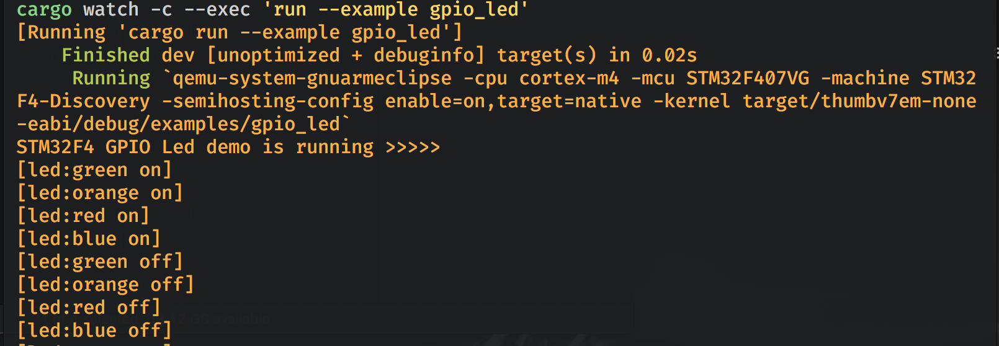

    Also, see the blinking LED in dev board UI:

    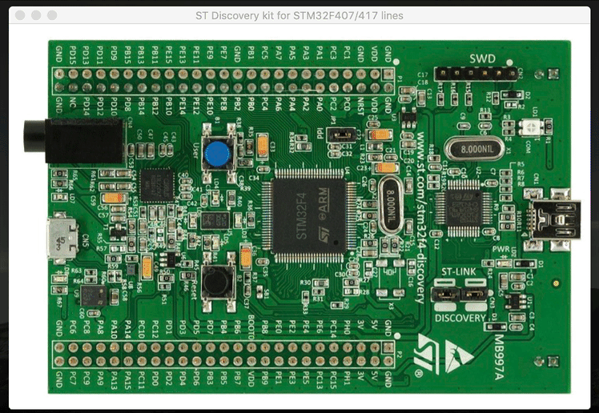

</br>

## <a name="something-you-need-to-know-before-we-dive-deep">4. Something you need to know before we dive deep</a>

If anyone of you is coming from high-level language programming with zero hardware programming background, then the chapter below is very important for you, as we will go through all the basic concepts and details about **hardware programming**.

#### <a name="mcu-register">4.1 About STM32F4 MCU registers</a>

A register is a special region of memory that controls a **peripheral**. 
A **peripheral** is a piece of electronics that sits right next to the processor within the microcontroller package and provides the processor with extra functionality. 
After all, the processor, on its own, can only do math and logic.
There are couples of supported peripherals inside the `STM32F4 MCU`:

- GPIO
- I2C
- SPI
- USART
- RCC
- ....etc

Why we use `MCU`? The usual reason is that: Want to control the external peripherals (some kind of sensors, robot arms, motors, etc).
So the question is How you can control the external peripherals? The answer is via the **peripheral register** inside the `MCU`.
Each peripheral includes a couple of registers which call `RegisterBlock` in `stm32f` PAC (Peripheral Access Crate) or HAL (Hardware Abstraction Layer Crate) like below:

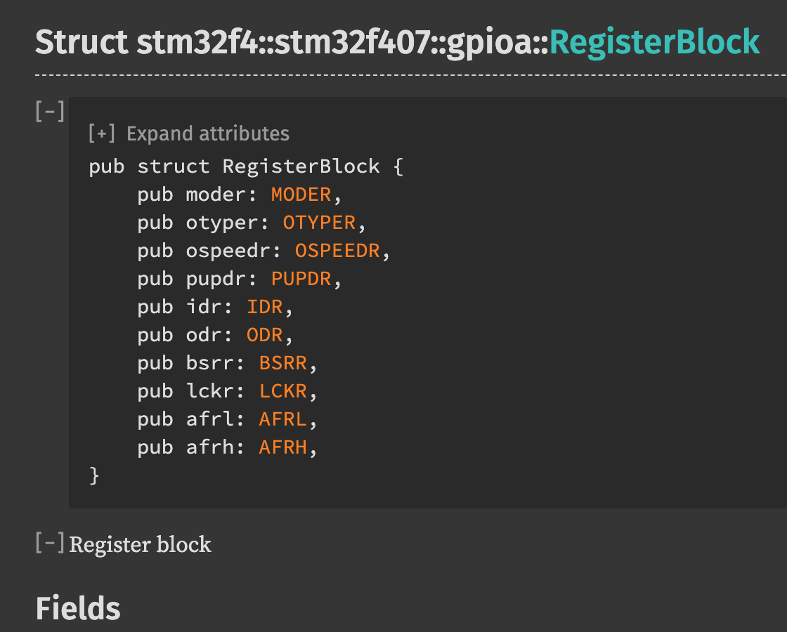

If you have no idea about what those registers for, just leave it at this moment, we will get into the detail later.

But before dive into the **GPIO** register, let's take a look at how those peripherals are connected. Below is the `STM32F4 block diagram` in [`datasheet`](./stm32f407vg-datasheet.pdf) (page 19):

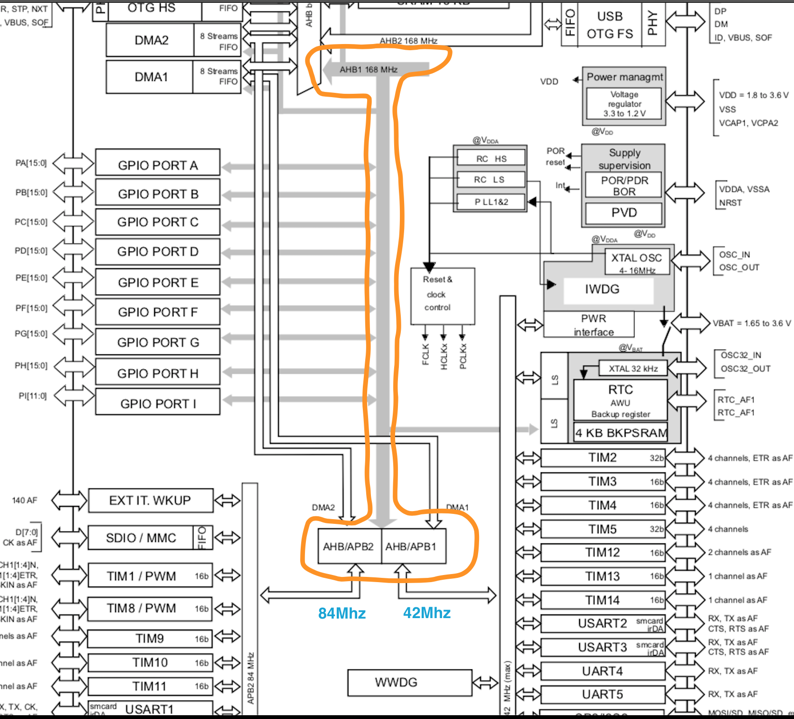

As you can see, the orange highlighted part is the system bus, all supported peripherals connected onto it:

- **AHB1** can up to **168Mhz** (`STM32F407VG` for example)
- **AHB1** separated into 2 extra bus for connecting to different peripherals:
    - **AHB1/APB2** is high speed which can up to **84Mhz**
    - **AHB1/APB1** is low speed which can up to **42Mhz**

Ok, so we got enough basic knowledge for the peripheral registers, let's pick the **GPIO registers** as the experimental case and write some low-level code to control the **GPIO register** to turn-on and turn-off the onboard LEDs.


</br>

#### <a name="mcu-gpio-register">4.2 STM32F4 **GPIOP** registers</a>

This particular register controls **G**eneral **P**urpose **I**nput/**O**utput (**GPIO**) pins (**GPIO** is a peripheral) and can be used to drive each of those pins **low** or **high**:
- **Low** means the particular pin is **0** voltage.
- **Hight** means the particular pin is **output** voltage. For example **5v** or **3.3v** which depends on your `MCU`.


Let's take a look at the **GPIO** registers in the [`reference manual`](./stm32f4-reference-manual.pdf) page **267**:

Each **GPIO** port has ten reigsters:
- Four 32-bit configuration registers (**GPIOx_MODER, GPIOx_OTYPER, GPIOx_OSPEEDR and GPIOx_PUPDR**).
- Two 32-bit data registers (**GPIOx_IDR and GPIOx_ODR**). 
- A 32-bit set/reset register (**GPIOx_BSRR**). 
- A 32-bit locking register (**GPIOx_LCKR**).
- Two 32-bit alternate function selection register (**GPIOx_AFRH and GPIOx_AFRL**).

**x** means the port number, each **GPIO** port can handle 16 pins (pin0 ~ pin15). How many **GPIO** port (the **x** value) you have totally depended on the `MCU` itself. For `STM32F407VG` has `GPIOA ~ GPIOK` (11 ports).

It sounds crazy, but let's only focus on the registers below:

- **GPIOx_MODER**: Modify register, it‘s responsible for setting the GPIO pin to **output** or **input** mode.
- **GPIOx_OTYPER**: Output type register, it's responsible for setting the GPIO pin to specified type: **PushPull, OpenDrain**.
- **GPIOx_IDR**: Input data register, it's responsible for reading data from the GPIO pin.
- **GPIOx_ODR**: Output data register, it's responsible for writing data to the GPIO pin. _But we don't use it, we use **GPIOx_BSRR** instead, that's an atomic write operation._
- **GPIOx_BSRR**: Bit set/reset register, use to write **High** or reset to **Low** to the GPIO pin.

</br>

#### <a name="how-to-control-gpio-register">4.2.1 How to control the GPIO register</a>

Usually, we need a few steps to control the particular peripheral registers:
- Enable it
- Configure it
- Read data from or write data to it

All steps above need the register memory address and we can find it in the [`reference manual`](./stm32f4-reference-manual.pdf).

In the next demo, we want to turn-on and turn-off the onboard LEDs. For the first step, we need to open 
[Discovery_kit_withlSTM32F407VG_MCU_user_manual.pdf](./Discovery_kit_withlSTM32F407VG_MCU_user_manual.pdf) and jump to page 16, then we can see the info below:

```
• User LD3: orange LED is a user LED connected to the I/O PD13 of the
STM32F407VGT6.
• User LD4: green LED is a user LED connected to the I/O PD12 of the STM32F407VGT6.
• User LD5: red LED is a user LED connected to the I/O PD14 of the STM32F407VGT6.
• User LD6: blue LED is a user LED connected to the I/O PD15 of the STM32F407VGT6.
```

So we know that all the LEDs are connected to the **GPIO** port **D** with the `pin 12 ~ pin 15`.

Let's walk through all those steps to reach our goal:

</br>

##### <a name="how-to-enable-gpio-d">4.2.1.1 How to enable the `GPIO` port `D`</a>

When you first turn on the `MCU`, everything turns off for power saving. We need to enable the **GPIOD**.
And here are the tips: 

- Search `gpioded` which stands for "gpiod enable" in the [`reference manual`](./stm32f4-reference-manual.pdf), then we got this at page 243:

    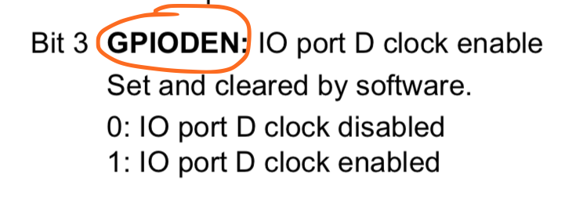

    <hr>

    _Then scroll up to the page 242:_

    <hr>

    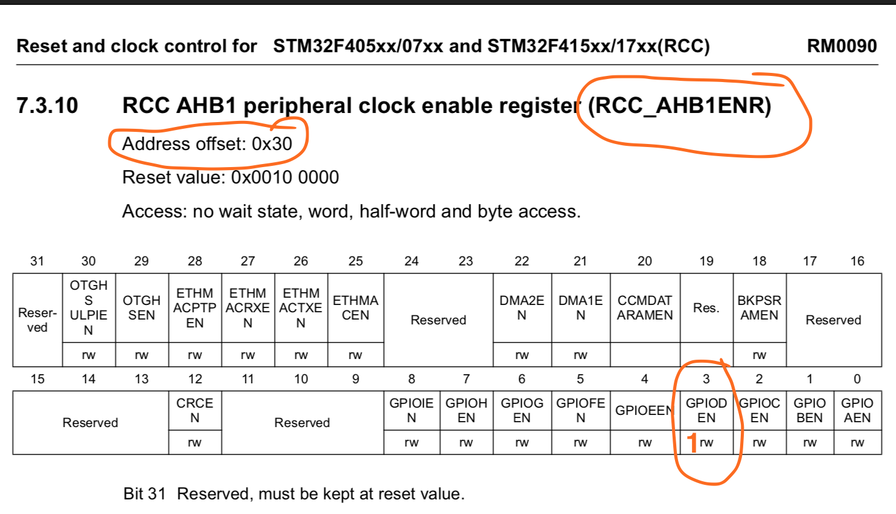

    <hr>

    _also, we got the low power mode setting at page 250 as well:_

    <hr>

    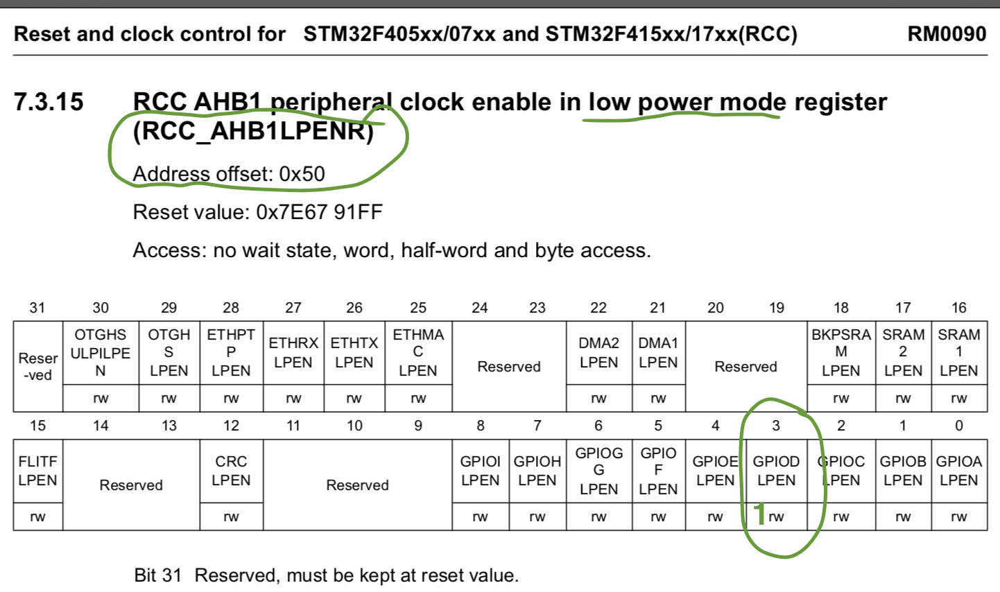

    <hr>

    So what information we got here?
    
    - **GPIOD** connects to **AHB1** bus
    - There is an **RCC_AHB1ENR** register responsible for enabling the **GPIOD**
    - We need to set the **RCC_AHB1ENR** register `bit3` to `1`, then **GPIOD** will be enabled.
    - The **RCC_AHB1ENR** register memory address offset is **0x30**
    
    </br>

    We got a register address _offset_, then what is the address _base_? Keep searching `boundary address`, so we got it in page 65:
    
    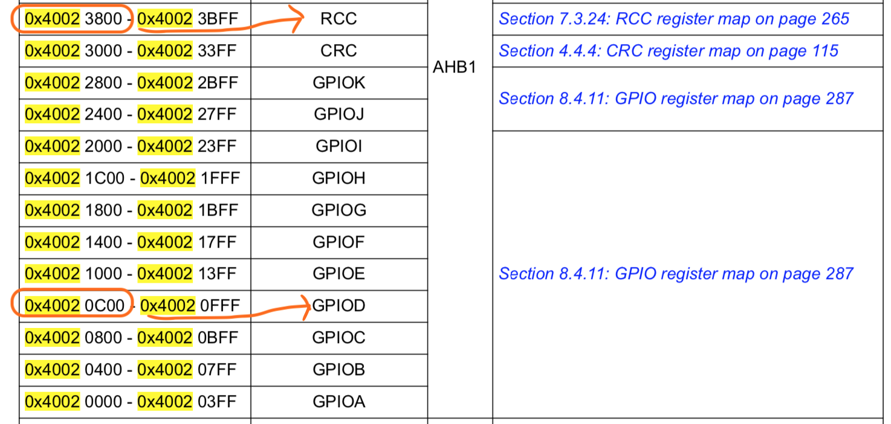
    
    That means the **RCC_AHB1ENR** register memory address will be **0x40023800 + 0x30** which is **0x40023830**.
    
    ###### _**RCC** stand for **Reset and Clock Control**_
    
    There is an **RCC register map** table in [`reference manual`](./stm32f4-reference-manual.pdf) page 265 as well.

    </br>

- Then we're able to write `rust` code to enable the **GPIOD** like below:

    ```rust
    const RCC_REGISTER: u32 = 0x40023800;
    const RCC_AHB1ENR_REGISTER: u32 = RCC_REGISTER + 0x30; // page 242, 243
    const RCC_AHB1LPENR_REGISTER: u32 = RCC_REGISTER + 0x50; // Low power (sleep) mode, page 250, 252,
    unsafe {
        // Enable `GPIOD` by setting the `bit3` to `1` for both registers.
        *(RCC_AHB1ENR_REGISTER as *mut u32) = 1 << 3;
        *(RCC_AHB1LPENR_REGISTER as *mut u32) = 1 << 3;
    }
    ```

</br>

##### <a name="if-you-dont-know-the-bitwise-operation">4.2.1.2 If you don't know the bitwise operation?</a>

Just a quick tips if you don't know (or totally forgot what you learned from school), here is how you handle the bitwise operation:

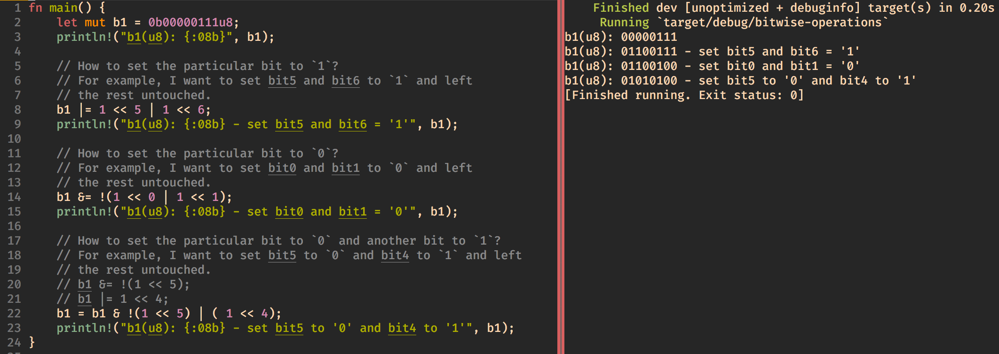

</br>

##### <a name="how-to-configure-gpio-d-to-output-mode">4.2.1.3 How to configure the `GPIO` port `D` to **output** mode</a>

Let's go to the [`reference manual`](./stm32f4-reference-manual.pdf) page 281, then we will see the info below:

<hr>

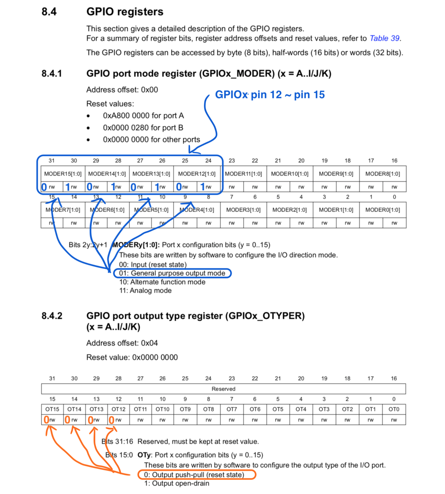

<hr>

So what information we got here?

- **GPIOD_MODER** uses to configure the register mode, take a look at the blue highlighted part:
    - `MODER12` means **pin 12**, `MODER13` means **pin 12**, ..., `MODER15` means **pin 15**
    - Each pin use 2 bits to set the register to the particular mode
    - For setting the **pin 12** to output mode, we need to set `01` to `bit25` and `bit24`
    - ...
    - For setting the **pin 15** to output mode, we need to set `01` to `bit31` and `bit30`

    </br>

- **GPIOD_OTYPER** uses to configure the register output type, take a look at the orange highlighted part:
    - Each pin use 1 bit to set the register to the particular output mode
    - For setting the **pin 12** to `push-pull` mode, we need to set `0` to `bit12`
    - ...
    - For setting the **pin 15** to `push-pull` mode, we need to set `0` to `bit15`

    </br>

- Then we're able to write `rust` code to configure **GPIOD** work in **output** mode like below:

    ```rust
    // `GPIOD` register mapping address, in `reference manual` page 65, (`STM32F4xx register boundary addresses`).
    const GPIOD_REGISTER: u32 = 0x40020c00;

    // GPIO port mode register (GPIOx_MODER) address, `reference manual` page 281.
    const GPIOD_MODER: u32 = GPIOD_REGISTER + 0x00;
    let gpiod_moder_mut_ptr: *mut u32 = GPIOD_MODER as *mut u32; // Mutable raw pointer
    let gpiod_moder_ptr: *const u32 = GPIOD_MODER as *const u32; // Immutable raw pointer
    unsafe {
        // Set `GPIOD` pin12 ~ pin15 to OUTPUT mode

        // Keep the prev value and add (`|`) new setting:
        // bit 25, 24 set to `01`
        // bit 27, 26 set to `01`
        // bit 29, 28 set to `01`
        // bit 31, 30 set to `01`
        *gpiod_moder_mut_ptr |= (1 << 24) | (1 << 26) | (1 << 28) | (1 << 30);

        // Let's print the "GPIOD_MODER" register bit value (32bit, 4 bytes), and it should be:
        // 0b01010101000000000000000000000000
        // 
        // From right to left is bit0 ~ bit31, only bit24, bit26, bit 28, bit30 set to `1`.
        #[cfg(feature = "enable-debug")]
        let _ = hprintln!("GPIOD_MODER: {:#034b}", *gpiod_moder_ptr);
    }

    // GPIO port output type register (GPIOx_OTYPER) address, `reference manual` page 281.
    // As the output type `push-pull` is `0`, then we don't need to set `GPIOD_OTYPER` explicitly.
    // const GPIOD_OTYPER: u32 = GPIOD_REGISTER + 0x04;
    ```

</br>

##### <a name="how-to-toggle-gpiod-pin-voltage">4.2.1.4 How to set the `GPIO` port `D` (pin12 ~ pin15) to `High` or `Low`</a>

Let's go to the [`reference manual`](./stm32f4-reference-manual.pdf) page 284, then we will see the info below:

<hr>

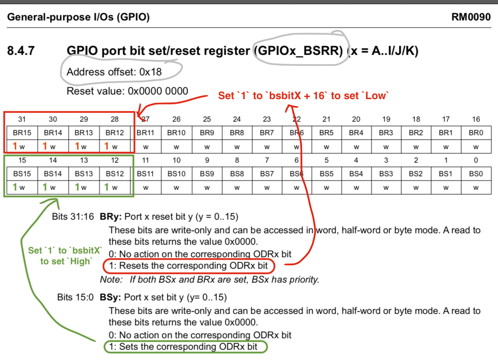

<hr>

So what information we got here?

- **GPIOD_BSSR** uses to set the register value (`High` or `Low`)

    - How to set `High`, take a look at the green highlighted part:
        - `bit0` to `bit15` means **pin 0** to **pin 15** and use to set `High`
        - After setting to `1`, it will set the corresponding **GPIOD_ODR** register bit
        - Nothing will happen when setting the `0` to the specified bit
        - For setting the **pin 12** to `High`, we need to set `bit12` to `1`
        - ...
        - For setting the **pin 15** to `High`, we need to set `bit15` to `1`

        </br>

    - How to set `Low`, take a look at the red highlighted part:
        - `bit16` to `bit31` means **pin 0** to **pin 15** and use to set `Low`
        - After setting to `1`, it will set the corresponding **GPIOD_ODR** register bit
        - Nothing will happen when setting the `0` to the specified bit
        - For setting the **pin 12** to `Low`, we need to set `bit(12 + 16)` to `1`
        - ...
        - For setting the **pin 15** to `Low`, we need to set `bit(15 + 16)` to `1`


    </br>

- Then we're able to write `rust` code to set **pin 12~15** to `High` or `Low` like below:

    ```rust
    // GPIO port bit set/reset register (GPIOx_BSRR) address, `reference manual` page 284.
    const GPIOD_BSRR: u32 = GPIOD_REGISTER + 0x18;
    let gpiod_bsrr_mut_ptr = GPIOD_BSRR as *mut u32;

    // Setup GPIOD.P12 ~ P15 to output mode with `

    unsafe {
        // Set bit (pin) 12 ~ 15 to `1` to turn on 4 LEDs. As the "GPIOD_BSRR" does nothing when
        //
        // As the "GPIOD_BSRR" does nothing when setting bit to `0`, so actually, we even don't 
        // need the `|=` for keeping the previous value.
        *gpiod_bsrr_mut_ptr = (1 << 12) | (1 << 13) | (1 << 14) | (1 << 15);
    }
    
    #[cfg(feature = "enable-debug")]
    let _ = hprintln!("\nDelay 1s......\n");

    delay.delay_ms(delay_time_in_ms);

    unsafe {
        // Set bit (pint) 12 + 16, 13 + 16 to `1` to turn off 2 LEDs. As the "GPIOD_BSRR" does nothing when
        //
        // As the "GPIOD_BSRR" does nothing when setting bit to `0`, so actually, we even don't 
        // need the `|=` for keeping the previous value.
        *gpiod_bsrr_mut_ptr = (1 << (12 + 16)) | (1 << (13 + 16));
    }
    ```
</br>

#### <a name="use-raw-gpio-register-to-control-led">4.3 Finally, Let's put all together: use raw GPIO register to control LED</a>

- Make sure your `.cargo/config` has the settings below:

    We need to use the `runner` config without `-nographic`, then `QEMU` will open a dev board GUI, so we can see the blinking LED.

    ```rust
    [target.thumbv7em-none-eabi]
    # Settings below will make `cargo run` execute programs on QEMU
    # Normal version (with dev board UI)
    runner = "qemu-system-gnuarmeclipse -cpu cortex-m4 -mcu STM32F407VG -machine STM32F4-Discovery -semihosting-config enable=on,target=native -kernel"
    ```


- Create [`demo/src/bin/gpio_led_by_register.rs`](demo/src/bin/gpio_led_by_register.rs) with the following code:

    ```rust
    #![no_std]
    #![no_main]
    
    use cortex_m::asm::delay;
    use cortex_m_rt::entry;
    
    #[cfg(feature = "enable-debug")]
    use cortex_m_semihosting::hprintln;
    
    use panic_semihosting as _;
    
    // As we don't use `PAC` and `HAL` in this example, and we didn't touch the `Clock` and
    // `Interrupt` yet. That's why we use a dumb version `delay` at this moment. It's not
    // accuracy, that's fine, as that's not the point we focus on at this moment.
    fn dumb_delay(millisecond: u32) {
        delay(100_000 * millisecond);
    }
    
    #[entry]
    fn main() -> ! {
        #[cfg(feature = "enable-debug")]
        let _ = hprintln!("STM32F4 GPIO Register Led demo is running >>>>>");
    
        // Below is the very important step:
        //
        // When you first turn on the `MCU`, everything turns off for power saving. We need to enable
        // the `GPIOD` port. Info in `reference manual` (page 265, RCC register map).
        //
        // RCC (Reset and Clock Control)
        const RCC_REGISTER: u32 = 0x4002_3800;
        const RCC_AHB1ENR_REGISTER: u32 = RCC_REGISTER + 0x30; // page 242, 243
        const RCC_AHB1LPENR_REGISTER: u32 = RCC_REGISTER + 0x50; // Low power (sleep) mode, page 250, 252,
        unsafe {
            // Enable `GPIOD` by setting the `bit3` to `1` for both registers.
            *(RCC_AHB1ENR_REGISTER as *mut u32) = 1 << 3;
            *(RCC_AHB1LPENR_REGISTER as *mut u32) = 1 << 3;
        }
    
        // `GPIOD` register mapping address, in `reference manual` (page 65, `STM32F4xx register boundary addresses`).
        const GPIOD_REGISTER: u32 = 0x4002_0c00;
    
        // GPIO port mode register (GPIOx_MODER) address, `reference manual` (page 281).
        const GPIOD_MODER: u32 = GPIOD_REGISTER + 0x00;
        let gpiod_moder_mut_ptr: *mut u32 = GPIOD_MODER as *mut u32; // Mutable raw pointer
        let gpiod_moder_ptr: *const u32 = GPIOD_MODER as *const u32; // Immutable raw pointer
        unsafe {
            // Set `GPIOD` pin12 ~ pin15 to OUTPUT mode
    
            // Keep the prev value and add (`|`) new setting:
            // bit 25, 24 set to `01`
            // bit 27, 26 set to `01`
            // bit 29, 28 set to `01`
            // bit 31, 30 set to `01`
            //
            // As the "GPIOD_BSRR" does nothing when set bit to `0`, so actually, we even don't
            // need the `|=` for keeping the prev value. But we keep that just doing in the normal
            // way.
            //
            *gpiod_moder_mut_ptr |= (1 << 24) | (1 << 26) | (1 << 28) | (1 << 30);
    
            // Let's print the "GPIOD_MODER" register bit value (32bit, 4 bytes), and it should be:
            // 0b01010101000000000000000000000000
            //
            // From right to left is bit0 ~ bit31, only bit24, bit26, bit 28, bit30 set to `1`.
            #[cfg(feature = "enable-debug")]
            let _ = hprintln!("GPIOD_MODER: {:#034b}", *gpiod_moder_ptr);
        }
    
        // GPIO port output type register (GPIOx_OTYPER) address, `reference manual` (page 281).
        // As the output type `push-pull` is `0`, then we don't need to set `GPIOD_OTYPER` explicitly.
        // const GPIOD_OTYPER: u32 = GPIOD_REGISTER + 0x04;
    
        // GPIO port bit set/reset register (GPIOx_BSRR) address, `reference manual` (page 284).
        const GPIOD_BSRR: u32 = GPIOD_REGISTER + 0x18;
        let gpiod_bsrr_mut_ptr = GPIOD_BSRR as *mut u32;
    
        // Setup GPIOD.P12 ~ P15 to output mode with `
    
        unsafe {
            // Set bit (pin) 12 ~ 15 to `1` to turn on 4 LEDs.
            //
            // As the "GPIOD_BSRR" does nothing when setting bit to `0`, so actually, we even don't
            // need the `|=` for keeping the previous value.
            *gpiod_bsrr_mut_ptr = (1 << 12) | (1 << 13) | (1 << 14) | (1 << 15);
        }
    
        #[cfg(feature = "enable-debug")]
        let _ = hprintln!("\nDelay 1s......\n");
    
        dumb_delay(10000);
    
        unsafe {
            // Set bit (pint) 12 + 16, 13 + 16 to `1` to turn off 2 LEDs.
            //
            // As the "GPIOD_BSRR" does nothing when setting bit to `0`, so actually, we even don't
            // need the `|=` for keeping the previous value.
            *gpiod_bsrr_mut_ptr = (1 << (12 + 16)) | (1 << (13 + 16));
        }
    
        loop {}
    }
    ```

- How to run

    we don't need `PAL` or `HAL` crate anymore, as we will use low-level implementation:

    ```rust
    # cd demo
    cargo watch -c --exec 'run --bin gpio_led_by_register --features "enable-debug"'
    ```
    Every time you save `demo/src/bin/gpio_led_by_register.rs`, `cargo run --bin gpio_led_by_register` will run again.

    And you should be able to see the console log like below:

    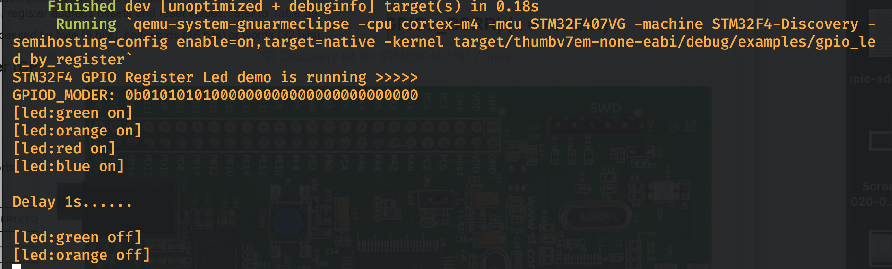

    Also, see 4 LEDs on and 2 off after 1s in dev board UI:

    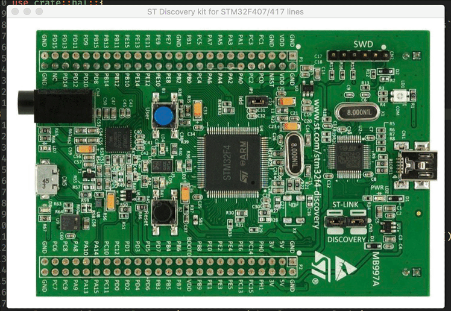

</br>

#### <a name="fix-the-bug-in-release-build">4.4 Let's fix the bug in release build</a>

Ok, so far, it works well in the **debug** mode. But actually it won't work like what we expected in the **release** mode.

Let's give it a try by running the commands below:

```bash
# Build and strip the release mode binary
cargo-strip --target thumbv7em-none-eabi --bin gpio_led_by_register --release

# Run that release mode binary in `QEMU`
qemu-system-gnuarmeclipse -cpu cortex-m4 -mcu STM32F407VG -machine STM32F4-Discovery -semihosting-config enable=on,target=native -kernel target/thumbv7em-none-eabi/release/gpio_led_by_register
```

And you should see **all LEDs are off and never on!!!** Wow, what happened there???

Let's take a look at the special lines below:

```rust
60:        *gpiod_moder_mut_ptr |= (1 << 24) | (1 << 26) | (1 << 28) | (1 << 30);

84:        *gpiod_bsrr_mut_ptr = (1 << 12) | (1 << 13) | (1 << 14) | (1 << 15);

95:        *gpiod_bsrr_mut_ptr = (1 << (12 + 16)) | (1 << (13 + 16));
```

For explaining the **potential bug** there, plz have a look the sample code below:

```rust
fn main() {
    let mut a = 10u8;
    println!("a: {}", a);

    let ptr_to_a = &mut a as *mut u8;
    unsafe {
        *ptr_to_a = 50u8;
        *ptr_to_a = 100u8;
        *ptr_to_a = 200u8;
        println!("a: {}", a);
    }
}
```

When building with `--release`, `LLVM` tries to optimize the code. As we assigned three times to the same memory which `ptr_to_a` points to, then `LLVM` may think and see the code like this:


```rust
let ptr_to_a = &mut a as *mut u8;
unsafe {
    // *ptr_to_a = 50u8;
    // *ptr_to_a = 100u8;
    *ptr_to_a = 200u8;
    println!("a: {}", a);
}
```

That's why our `*gpiod_moder_mut_ptr` be assigned with the `unexpected` value and caused the code work not correct.

So, how to fix it? That's easy, use [`core::ptr::write_volatile()`](https://doc.rust-lang.org/stable/core/ptr/fn.write_volatile.html) and [`core::ptr::read_volatile()`](https://doc.rust-lang.org/stable/core/ptr/fn.read_volatile.html) when we deal with register pointer:

```rust

60:     core::ptr::write_volatile(gpiod_moder_mut_ptr, (1 << 24) | (1 << 26) | (1 << 28) | (1 << 30));

84:     core::ptr::write_volatile(gpiod_bsrr_mut_ptr, (1 << 12) | (1 << 13) | (1 << 14) | (1 << 15));

95:     core::ptr::write_volatile(gpiod_bsrr_mut_ptr, (1 << (12 + 16)) | (1 << (13 + 16)));
```

The fixed version is in [gpio_led_by_register_fixed.rs](demo/src/bin/gpio_led_by_register_fixed.rs)

Try it right now, it should work as we expected:

```bash
cargo-strip --target thumbv7em-none-eabi --bin gpio_led_by_register_fixed --release
qemu-system-gnuarmeclipse -cpu cortex-m4 -mcu STM32F407VG -machine STM32F4-Discovery -semihosting-config enable=on,target=native -kernel target/thumbv7em-none-eabi/release/gpio_led_by_register_fixed
```

</br>

#### <a name="fun-part-code-comparison">4.5 The fun part, code comparison</a>

As maybe some of you are wondering which `coding solution` is better: The `HAL` one? or the `Low-level` one?

Let's make a code comparison to have a look (left-side is `HAL`, right-side is `Low-level`):

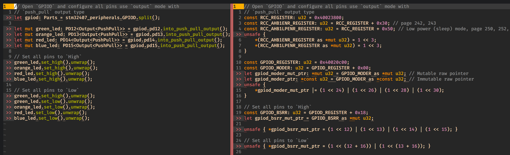

- `HAL` pros and cons:
    - It looks like less code (total lines for the same purpose).
    - It can fit all `STM32` series, just change the `features` in `Cargo.toml`.
    - But of course, you need to spent more time to learn the `HAL` crate and get familiar with it (concepts, structs, modules and functions).

</br>

- `Low-level` pros and cons:
    - Sometimes a little more code to setup the registers.
    - Not guaranteed can fit for all `STM32` series (actually, that's not possible).
    - It’s simple and good for hardware background developer: Just open the reference manual and check the particular register, then start to code. All you needed just the basic computer knowledge: bit wise operation.
    - As no more `PAC` or `HAL` needed, then you got full-control and output the binary size as small as possible.

_So that means no right answer, it totally depends on **YOU:)**_

</br>

#### <a name="we-will-choose-low-level-code-style">4.6 For the rest of the chapters, we pick the low-level (pure register controlling) code style for all demos, why?</a>

No matter what knowledge we’re learning, usually 2 steps we can follow:

_1. We only need to know how to use it. For example, turning on a light bulb or turning it off, that’s simple and fit the requirement as a normal user._

_2. We need to know how it works, then we’re able to change it, even improve it. For example, if you're an energy-saving light bulb company, then you have to figure out how the light bulb works and improve it, that’s another story._

That means there isn't an absolute right answer, it’s totally up to you, as you know what you want. But **we will pick the No.2 way to continue learning and use low-level register controlling style to code for the rest of demos**. Why?

- If you know how this works, then no more secrets you don't know,  you're able to build anything you want. And you should have the ability to work on professional `STM32` project in Rust.

- When you're working on your unique project, you got full control. How to say that? 

    - The `PAC` or `HAL` crate both are designed for generic use cases, may not suit your unique hardware product situation. Sometimes, you found that it's pretty not straightforward to reach what you want based on those crates.

    - Those crates are contributed by many people with different background and skill experience, it will have bugs. When you face that, you can't get fixed immediately as that's out of your control. For example, you can't ask for somebody to fix the bug you encountered as soon as possible (as you need that be fixed on your hardware product). That does not make sense for a generic purpose share library.

So that's why we should figure out the theory and the low-level implementation, then we got the benefits below:

_1. We only rely on the STM official reference manual._

_2. We got full control for picking the easy way and straight ahead solution to code._

_3. We can apply immediate fix or improvement idea or solution at any given time._

_4. After we got real experience, we can build our own `PAC` or `HAL` crate and contribute back to the community._

</br>

## <a name="what-is-the-clock-and-how-to-use-it">5. What is the `Clock` and how to use it</a>

### <a name="simple-clock-brief">5.1 Simple clock brief</a>

The `Clock` is a very important component in `MCU`, it provides the pulse for all components and peripherals to make sure they work correctly. `MCU` can't work without a stable clock signal, just like a human can't live without a stable blood pulse.

Because not everyone got solid electricity knowledge, then let's make it easy. Before you start coding your first `STM32` project, You need to know about the following concepts.

### <a name="what-is-clock-source-selecting">5.2 What is clock source selecting?</a>
The MCU runs on a specified working frequency, that's why we need to set the system clock (`SYSCLK`) working frequency. Usually, that frequency generated by multiple `Clock Sources`.

So, we can use the default clock source chose by the chip or we need to pick the one we need, and that process is called **Clock Source Selecting**.

### <a name="what-exactly-the-clock-is">5.3 What exactly the `Clock` is?</a>

The `Clock` we're talking about actually is `Oscillator`. If you google it or go to the wiki about `oscillator` (RC oscillator, crystal oscillator), it just a circuit, for example, it may look like below:

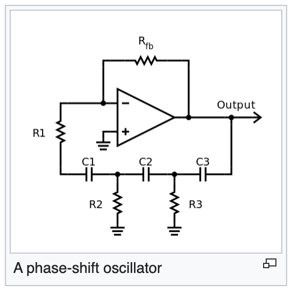

The physical look & feel will look like this:


Yes, that's the `Clock` we're talking about. The only thing you need to keep in mind is that: **That oscillator can generate a stable clock signal to drive all components and peripherals to work correctly.** 

You still can code your program without fully understand what that means, then no worry at this moment:)

Two major `Clock` type in the [reference manual](./stm32f4-reference-manual.pdf):

- Internal: it means the oscillator circuit is inside the `STM32` chip.
- External: it means the oscillator component is outside the `STM32` chip, usually soldered onboard.

</br>

### <a name="what-a-clock-tree-digram-looks-like">5.4 What a professional `Clock tree diagram` looks like?</a>

The below diagram is a screenshot from STMCubeMX projet, it shows a pretty straightforward strategy of clock source selecting:

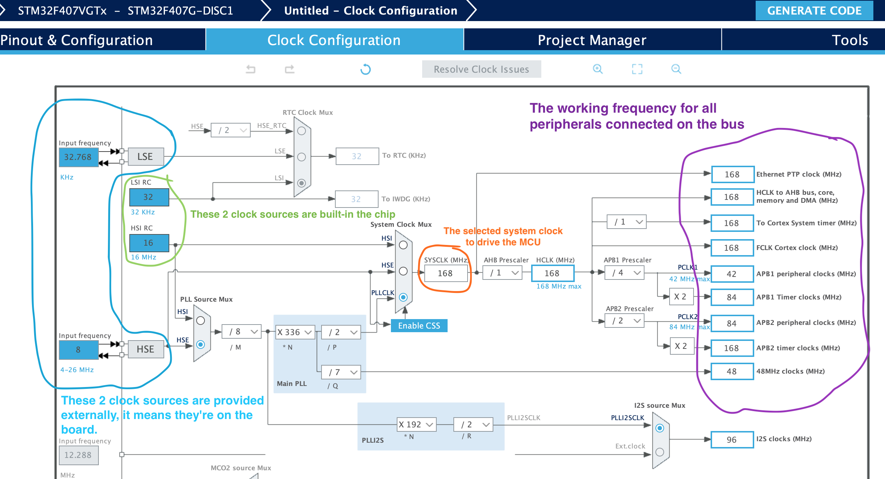

Yes, it looks very complicated and scary for the first time, but relax, it's not that hard actually:)

So what information we got from the diagram?   

- Based on the **blue** highlighted, we know that there are 2 external clock sources can connect to the chip for different purposes.

- Based on the **green** highlighted, we know that there are 2 internal clock sources inside the chip for different purposes.

- The **orange** highlighted shows what the final system clock (`SYSCLK`) working frequency will be.

- The **purple** highlighted let us know what exact working frequency on the particular peripherals.

That's it, that's enough for us at this moment.

_Tips:_

- _`STMCubeMX` is a `STMCube` project initialization and code generating tool which you can download [here](https://www.st.com/en/development-tools/stm32cubemx.html)._
- _`STMCubeMX` just an optional tool for us, as it generates the **C++** code, not the **Rust** code. But for the **Clock source selecting**, that diagram is super helpful for us, good to have._

</br>

### <a name="dive-deep-into-clock-source-selecting">5.5 Let's dive deep into the `clock source selecting`</a>

First thing first, there are a few kinds of `Clocks` in the [`reference manual`](./stm32f4-reference-manual.pdf) starts from page **215**, but we only need to focus on the three of them below:

- **HSE**

    High-Speed External clock signal, usually, it's external onboard oscillator hardware with the fixed working frequency. Make sure you check the hardware datasheet before setting `HSE` value (unit in Hertz).

- **HSI**
    
    High-Speed Internal clock signal, it's an internal 16 MHz RC oscillator.

- **PLL**

    This stuff is complicated, as it stands for **Phase-Locked Loop**. It sounds scary for you, as you have no idea what that means. Briefly, it takes the input frequency and uses different factor settings to change the output frequency.


So, let's have a close look at the `clock source selecting`:

We can pick one of the path below to as the clock source and
calculate the `SYSCLK` working frequency:

- **HSI** ------------------------------------------------------> **SYSCLK**
- **HSE** -----------------------------------------------------> **SYSCLK**
- **PLL** ----> (HSI or HSE) / PLL_M * PLL_N / PLL_P ---> **SYSCLK**

As you can see, it's not that hard:) 

When the expected working frequency is higher than `HSI` or `HSE` can offer, then you have to use `PLL` as clock source!!!

Let's have a look at them one by one:

- **HSI --> SYSCLK**:

    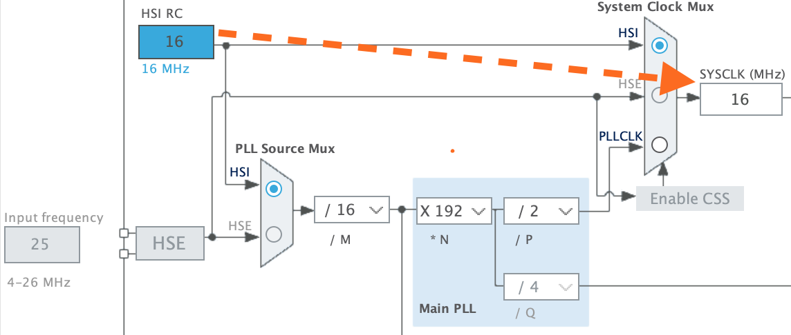

    This is the case of **HSI** as the clock source. You can see the **SYSCLK** get clock signal directly from **HSI** and the final working frequency is **16MHz**.

- **HSE --> SYSCLK**:

    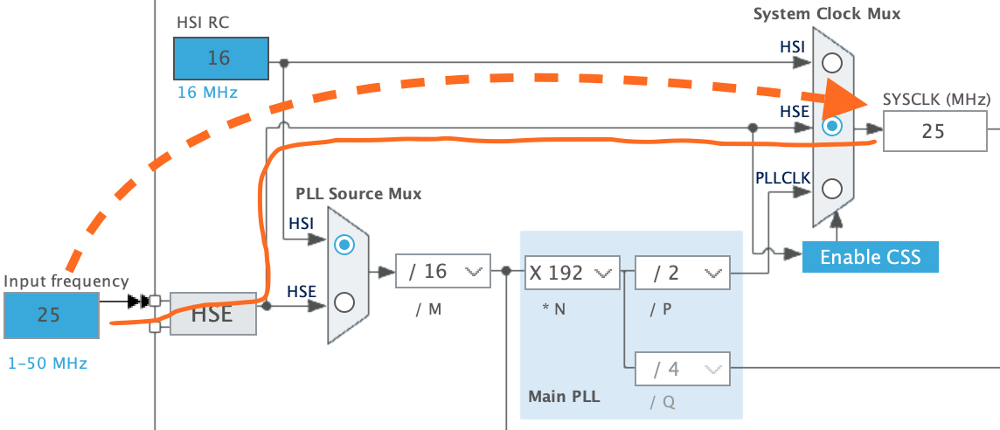

    This is the case of **HSE** as the clock source, also call `HSE bypass mode` (as not go through **PLL**). You can see the **SYSCLK** get clock signal directly from `HSE` and the final working frequency is **25MHz** (equal to **HSE** offered frequency).

- **PLL** ----> (HSI or HSE) / PLL_M * PLL_N / PLL_P ---> **SYSCLK**:

    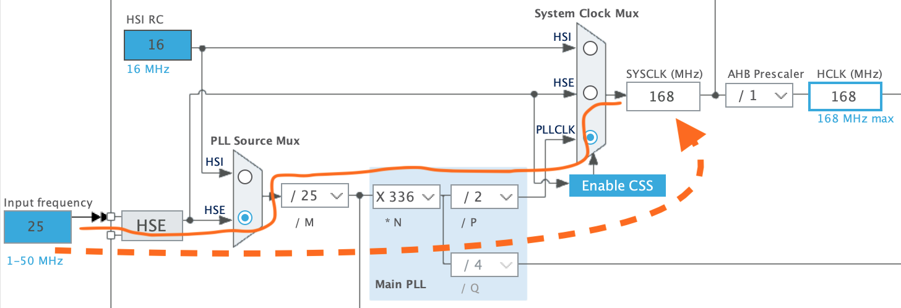

    This is the case of **HSE through PLL** as the clock source. You can see the **SYSCLK** get clock signal from `HSE` first, and then go through **PLL** factors (**M/N/P**) calculation, finally, got the working frequency is **168MHz**.

    For the **PLL_M/N/P**, usually, you don't need to worry about, as `STMCubeMX` will figure out the combination for you when you change the expected frequency in **HCLK**. But you can change it by youself.

    For example, when I change the **HCLK** frequency to **100MHz** like below, `STMCubeMX` calculates the combination for me:

    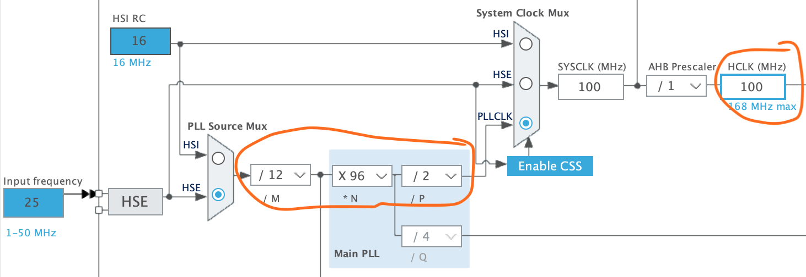

    But I can change it like below and got the same result:

    

    Here are the rules if you want to change that combination by youself:

    - When using **PLL** as clock source, we should calculate **SYSCLK** working frequency with the following formula:

        ```
        PLL_VCO = (HSE_FREQUENCY or HSI_FREQUENCY / PLL_M) * PLL_N
        SYSCLK = PLL_VCO / PLL_P

        `VCO` stands for `Voltage-Controlled Oscillator`
        ```

    - Tips for picking the right factor value:

        - `PLL_M`: We can always make it equal to the `HSI_FREQUENCY`
         or `HSE_FREQUENCY`, then:

            `(HSE_FREQUENCY or HSI_FREQUENCY / PLL_M)` always return `1`

            which more easy to to do the rest calculating. 
            
        - `PLL_P`: We can try start from `2`, then `PLL_M` and `PLL_P`
          already fixed, only left the `PLL_N` to choose.

        But keep in mind that `PLL_M/N/P` have to in the allowed range provided in the reference manual (page 227). 

        So the suggestion is always going to `STM32CubeMX` and use the automatic combination or change your settings in the UI, as it will tell you when your value is not working.

</br>

### <a name="write-code-for-system-clock-setting">5.6 Let's write some code to demonstrate system clock setting</a>

</br>

```rust
cargo watch -c --exec 'run --bin setup_and_print_system_clock --features "enable-debug enable-hal use-stm32f407g-disc1"'
cargo watch -c --exec 'run --bin setup_and_print_system_clock --features "enable-debug enable-hal use-weact-black-pill"'
```

</br>

## <a name="what-is-the-interrupt-and-how-to-use-it">6. What is the `Interrupt` and how to use it</a>

Up coming soon ...... :)

</br>


## <a name="about-optimize-the-binary-size">7. About optimizing the binary size</a>

Below are the steps we can optimize the final binary size:

- Remove unnecessary crate import.

- Remove `cortex_m_semihosting` and all `hprintln!()` calls, as we don't need that in production mode.

- Use `cargo-strip` to cut the symbol part which no needed in production mode.

    ```bash
    cargo strip --target thumbv7em-none-eabi --release --bin gpio_led_by_register

    ls -lht target/thumbv7em-none-eabi/release/gpio_led_by_register
    //  5.7K
    ```

</br>

