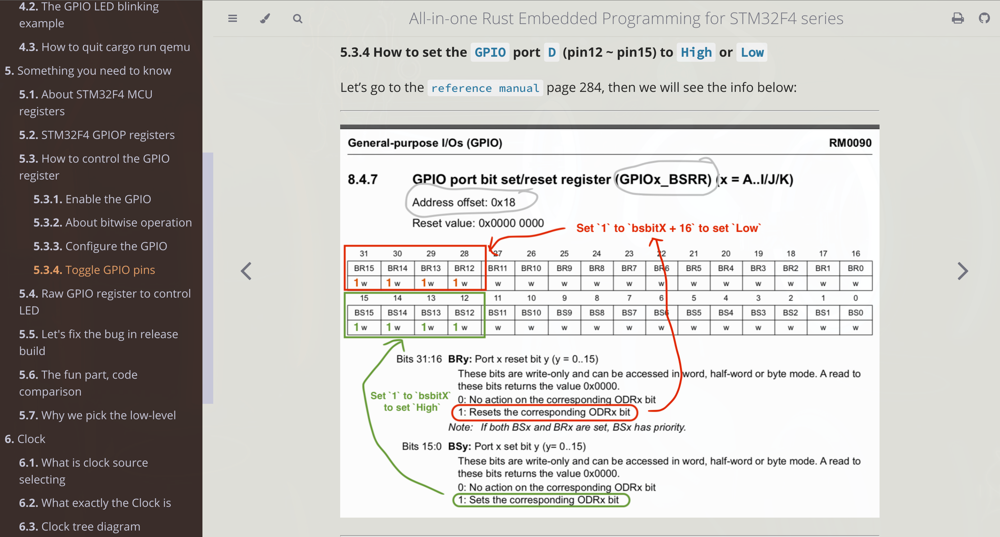
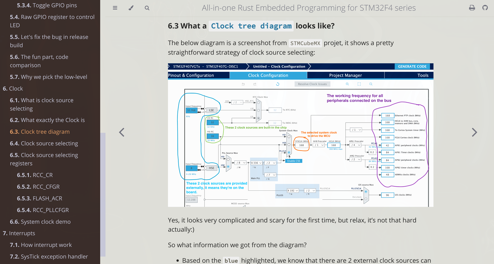
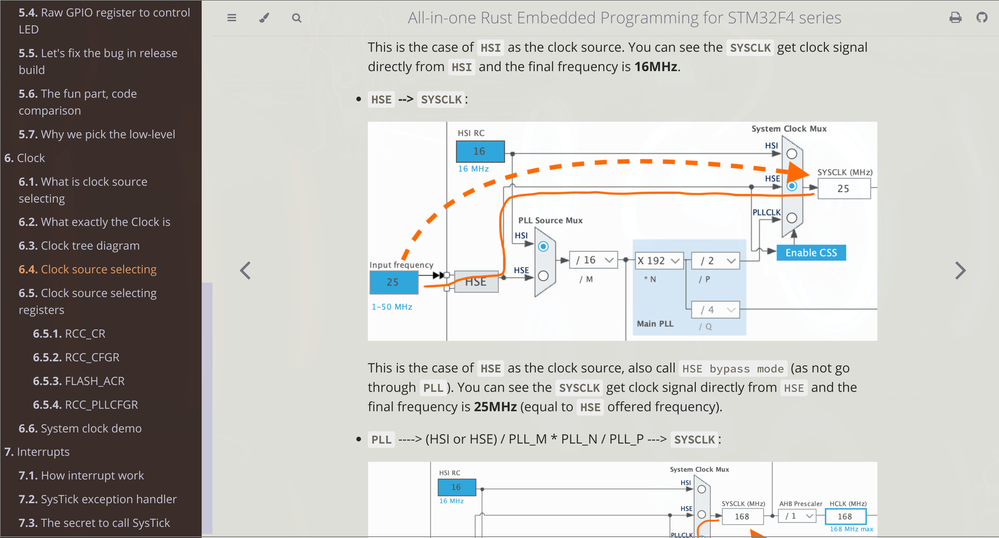
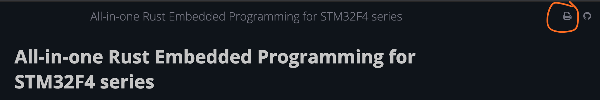

# All-in-one Rust Embedded Programming for STM32F4 series

In this book, we will cover all the pieces of knowledge we need to know for using `Rust` to do embedded programming.

And we pick the `ARM-based MCU STM32F4` series chips as our target to run all the demos.

## Chapter list content

- Introduction
- Important concepts
    - What is `MCU` and `SBC`
    - What is `STM32`
- About the hardware
- Setup Environment
    - Install tooling
    - Create a `demo` project
    - Run hello example in `QEMU`
    - Run hello example in hardware
- Write the first example
    - The basic example
    - The GPIO LED blinking example
    - How to quit cargo run qemu
- Something you need to know
    - About STM32F4 MCU registers
    - STM32F4 **GPIOP** registers
    - How to control the GPIO register
        - Enable the `GPIO`
        - About bitwise operation
        - Configure the `GPIO`
        - Toggle `GPIO` pins
    - Raw GPIO register to control LED
    - Let's fix the bug in release build
    - The fun part, code comparison
    - Why we pick the low-level
- Clock
    - What is clock source selecting
    - What exactly the `Clock` is
    - `Clock tree diagram`
    - `Clock source selecting`
    - `Clock source selecting` registers
        - RCC_CR
        - RCC_CFGR
        - FLASH_ACR
        - RCC_PLLCFGR
    - System clock demo
- Interrupts
    - How interrupt work
    - `SysTick` exception handler
    - The secret to call `SysTick`







</br>

## How to run 

- The book is created by [`mdbook`](https://rust-lang.github.io/mdBook/).

- How to install `mdBook`

    - Install via `cargo`:
        
        ```bash
        cargo install mdBook
        ```
    - About another way to install, plz check [here](https://github.com/rust-lang/mdBook)

- How to view the book in your browser

    Make sure you're in the repo root folder and run:

    ```bash
    # Clean the prev build
    mdbook clean ./tutorial

    # Serve it via HTTP server
    mdbook serve --open ./tutorial
    ```

    It will build the book into `tutorial/book` folder and open it your browser.

    How to export the book into **PDF** format?

    That's pretty easy, in the browser, click on the `print` icon on the right-top to save as **PDF**:

    

- Or you can open the PDF version [here](./all-in-one_rust_embedded_programming_for_stm32f4_series.pdf)

