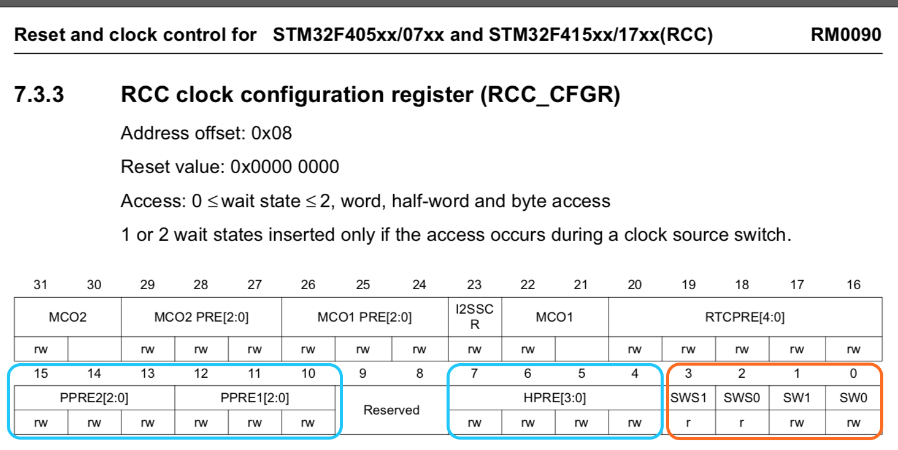
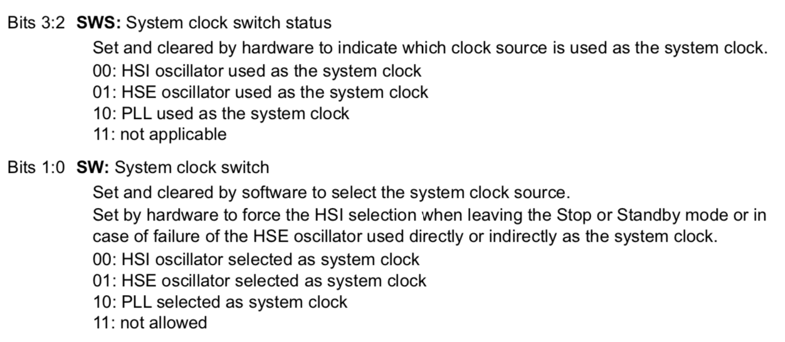
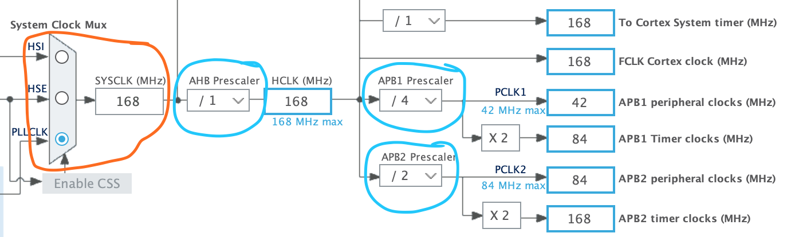
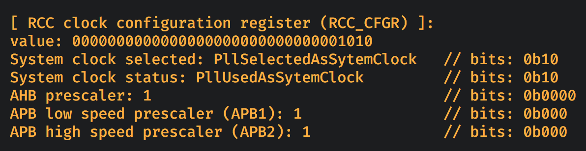

#### <a name="rcc_cfgr">6.5.2 RCC clock configuration register (`RCC_CFGR`)</a>

[`reference manual`](https://github.com/wisonye/rust-embedded-with-stm32f4/blob/master/stm32f4-reference-manual.pdf) page 228:

What information we got from this diagram?

- `bit0 ~ bit1` controls the final clock switching.

    

- `bit2 ~ bit3` represents whether the switched clock is stable or not.

- `bit4 ~ bit7` controls the `AHB bus prescaler` which uses to calculate the **`HCLK`** by **`SYSCLK`** frequency.

- `bit10 ~ bit12` controls the `APB low speed prescaler (APB1)`.

- `bit13 ~ bit15` controls the `APB high speed prescaler (APB2)`.

 

It's all about the highlighted settings in the diagram below:

 

Here is the source: [demo/src/register_utils/rcc_clock_config_register.rs](https://github.com/wisonye/rust-embedded-with-stm32f4/blob/master/demo/src/register_utils/rcc_clock_config_register.rs)

When the final demo runs, the `RCC_CFGR` register debug info will look like below:

