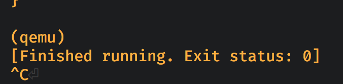

#### <a name="how-to-quit-cargo-run-qemu">4.3 How to quit cargo run qemu</a>

The previous example shows us how to run `cargo watch` and `qemu` together like below:

```rust
# cd demo
cargo watch -c --exec 'run --bin gpio_led --features "enable-debug enable-hal"'
```

But how can you stop and quit that process?

- If `qemu` is running without `-nographic` option, that's easy, just quit the `qemu` UI will quit the `qemu` process.

- If `qemu` is running with `-nographic` option, then you need to follow the steps below:

    - Type `Enter` go into `qemu` CLI, and you can see the `(qemu)` prompt there.

    - Type `quit` and enter, you **CANNOT SEE** what you're typing in, but it just works.

    - Type `Control + C` to end the `cargo run` process.

    

