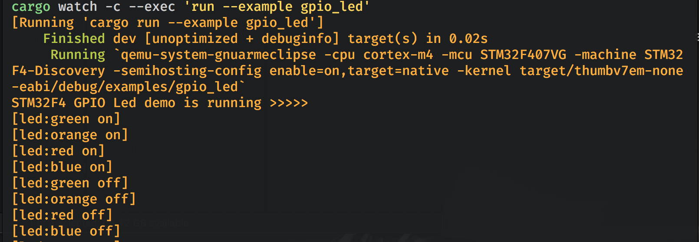
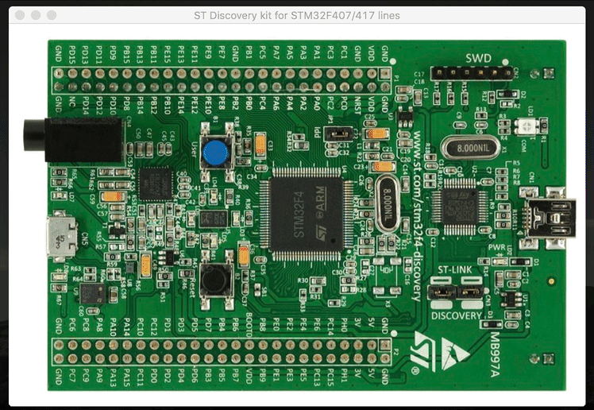

#### <a name="the-gpio-led-example">4.2 The GPIO LED blinking example</a>

In this example, we will use `HAL` crate rather than using `PAC` which provides a better high-level abstraction API for coding.
The `HAL` crate is [`stm32f4xx-hal`](https://crates.io/crates/stm32f4xx-hal), also make sure enable the `stm32f407` feature, as
that's the `MCU` we use.

- Make sure your `.cargo/config` has the settings below:

    We need to use the `runner` config without `-nographic`, then `QEMU` will open a dev board GUI, so we can see the blinking LED.

    ```rust
    [target.thumbv7em-none-eabi]
    # Settings below will make `cargo run` execute programs on QEMU
    # Normal version (with dev board UI)
    runner = "qemu-system-gnuarmeclipse -cpu cortex-m4 -mcu STM32F407VG -machine STM32F4-Discovery -semihosting-config enable=on,target=native -kernel"
    ```


- Create [`demo/src/bin/gpio_led.rs`](https://github.com/wisonye/rust-embedded-with-stm32f4/blob/master/demo/src/bin/gpio_led.rs) with the following code:

    ```rust
    #![no_std]
    #![no_main]
    
    use cortex_m_rt::entry;
    
    #[cfg(feature = "enable-debug")]
    use cortex_m_semihosting::hprintln;
    
    use panic_semihosting as _;
    
    #[cfg(feature = "enable-hal")]
    use crate::hal::{prelude::*, stm32};
    
    // This is very important!!!
    #[cfg(feature = "enable-hal")]
    use stm32f4xx_hal as hal;
    
    // Import from `stm32f4xx_hal`
    #[cfg(feature = "enable-hal")]
    use hal::{
        delay::Delay,
        gpio::{
            gpiod::{Parts, PD12, PD13, PD14, PD15},
            Output, PushPull,
        },
        rcc::Rcc, // Constrained RCC peripheral
    };
    
    #[entry]
    fn main() -> ! {
        #[cfg(feature = "enable-debug")]
        let _ = hprintln!("STM32F4 GPIO Led demo is running >>>>>");
    
        let stm32407_peripherals = stm32::Peripherals::take().unwrap();
        let cortex_m_peripherals = cortex_m::peripheral::Peripherals::take().unwrap();
    
        // Set up the LEDs. Below LED info copied from STM32F4Discovery user manual:
        //
        // • User LD3: orange LED is a user LED connected to the I/O PD13 of the STM32F407VGT6.
        // • User LD4: green LED is a user LED connected to the I/O PD12 of the STM32F407VGT6.
        // • User LD5: red LED is a user LED connected to the I/O PD14 of the STM32F407VGT6.
        // • User LD6: blue LED is a user LED connected to the I/O PD15 of the STM32F407VGT6.
        //
        // All those LED pins group into the port `D` which defined here:
        // https://docs.rs/stm32f4xx-hal/0.8.3/stm32f4xx_hal/stm32/struct.GPIOD.html#method.split
        //
        // `GPIOD.splt()` return a `Parts` struct instance which include all pins with the default
        // <MODE<type state>> which is `Input<Floating>`:
        // https://docs.rs/stm32f4xx-hal/0.8.3/stm32f4xx_hal/gpio/gpiod/struct.Parts.html
        let gpiod: Parts = stm32407_peripherals.GPIOD.split();
    
        // Take all those LED pins and convert into `Output` mode with `PushPull` type state
        let mut green_led: PD12<Output<PushPull>> = gpiod.pd12.into_push_pull_output();
        let mut orange_led: PD13<Output<PushPull>> = gpiod.pd13.into_push_pull_output();
        let mut red_led: PD14<Output<PushPull>> = gpiod.pd14.into_push_pull_output();
        let mut blue_led: PD15<Output<PushPull>> = gpiod.pd15.into_push_pull_output();
    
        // Set up the system clock. We want to run at 16Mhz for this one.
        let constrained_rcc_peripheral: Rcc = stm32407_peripherals.RCC.constrain();
        let clocks = constrained_rcc_peripheral.cfgr.sysclk(16.mhz()).freeze();
    
        // Create a delay abstraction based on SysTick
        let mut delay = Delay::new(cortex_m_peripherals.SYST, clocks);
    
        // I don't know how the `sysclk` works and how to set the correct `Mhz`, but for now,
        // the `excepted_delay_time_in_ms` needs to cut half for getting the correct delay time.
        let expected_delay_time_in_ms = 1000u32;
        let delay_time_in_ms = (expected_delay_time_in_ms / 2) as u32;
    
        loop {
            // On for 1s
            green_led.set_high().unwrap();
            orange_led.set_high().unwrap();
            red_led.set_high().unwrap();
            blue_led.set_high().unwrap();
    
            delay.delay_ms(delay_time_in_ms);
    
            // off for 1s
            green_led.set_low().unwrap();
            orange_led.set_low().unwrap();
            red_led.set_low().unwrap();
            blue_led.set_low().unwrap();
    
            delay.delay_ms(delay_time_in_ms);
        }
    }
    ```

- How to run

    ```rust
    # cd demo
    cargo watch -c --exec 'run --bin gpio_led --features "enable-debug enable-hal"'
    ```
    Every time you save `demo/src/bin/gpio_led.rs`, `cargo run --bin gpio_led` will run again.

    And you should be able to see the console log like below:

    

    Also, see the blinking LED in dev board UI:

    
