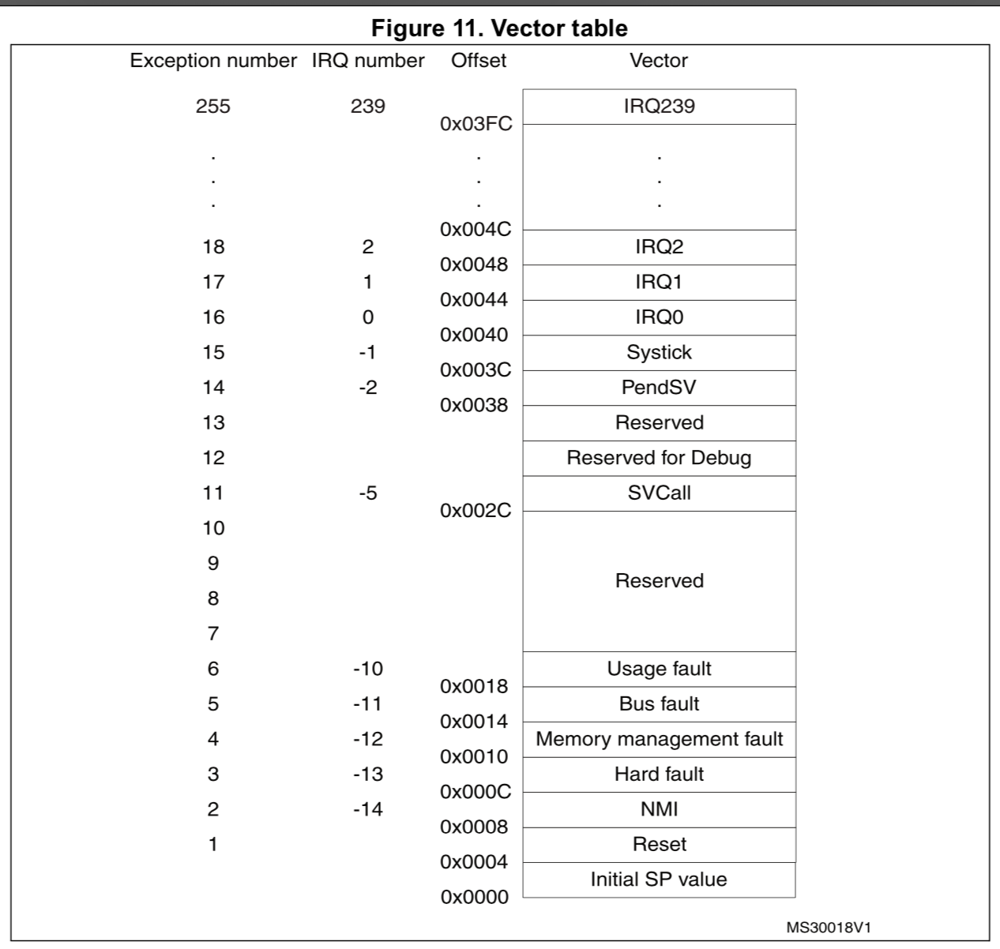

### <a name="how-exception-works">7.1 How interrupt works?</a>

For explaining how the interrupt works or say how an `ISR` (Interrupts Service Routine) gets called, 
we should take a look at the **`Vector Table`** first:

When hardware or software `event` occurred, `MCU` will call the `Exception Handler` or `Interrupt Service Routine (ISR)` 
to do something related to that event. But the question is how the `MCU` knows that where to find that 
particular function to call it? The answer prints on the **`Vector Table`**, that's the fixed memory layout
for particular `MCU`.

Before diving into `NVIC`, let's have a quick look at how to handle the `SysTick` exception handler.

 

