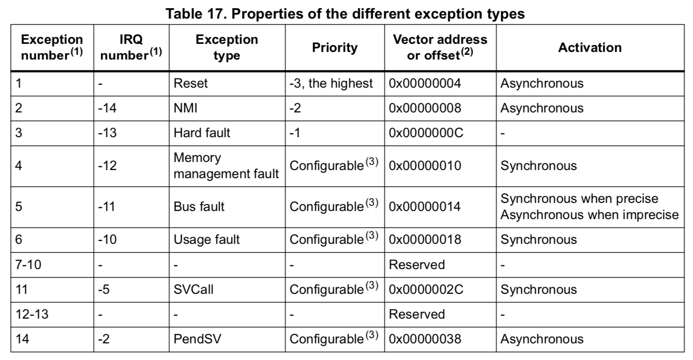
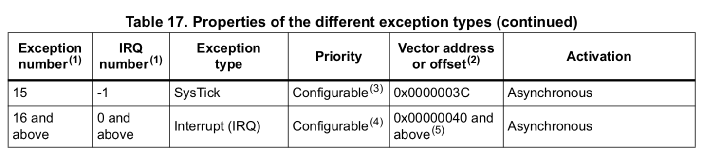

## <a name="simple-clock-brief">7. Simple brief of `Interrupts`</a>
An `interrupt`, or `IRQ`, is an exception signalled by a peripheral, or generated by a software request. 
Yes, `interrupt` actually just an `exception` type in the `Cortex-M4` exception model.

`interrupt` has the following features:

- Run asynchronous:

    _All interrupts are _**asynchronous to instruction execution**_. In the system, peripherals use interrupts to communicate with the processor._

- With different states:
    - _`Inactive`:_

        _The exception is not active and not pending._

    - _`Pending`:_

        _The exception is waiting to be serviced by the processor._

    - _`Active`:_

        _An interrupt request from a peripheral or from software can change the state of the corresponding interrupt to pending._

        _An exception that is being serviced by the processor but has not completed._

        _Note: An exception handler can interrupt the execution of another exception handler. In this case both exceptions are in the active state._

    - _`Active and pending`: The exception is being serviced by the processor and there is a pending exception from the same source._

- With different priorities: 

    _Lower value means higher priority._

- With a specified `IRQ` number (`IRQn`):

    _`IRQn` points to the particular memory address. When the `interrupt` happens, the code in that memory will be executed asynchronously._

 

Below is the `Cortex-M4` exception tables:

As you can see an exception can be executed in `synchronous` or `asynchronous`.  So, _We should use `Rust Concurrency Model` to think when dealing with interrupts._ Please keep that in mind, it's super important!!!

 

The last thing you should know is `Exception handler`, it just a function to be called when exception happens.

- **Interrupt Service Routines (`ISRs`)**: 

    _Interrupts `IRQ0` to `IRQ81` are the exceptions handled by `ISRs`._

- **Fault handlers**: 

    _Hard fault, memory management fault, usage fault, bus fault are fault exceptions handled by the fault handlers._

- **System handlers**: 

    _NMI, PendSV, SVCall SysTick, and the fault exceptions are all system exceptions that are handled by system handlers._

 

