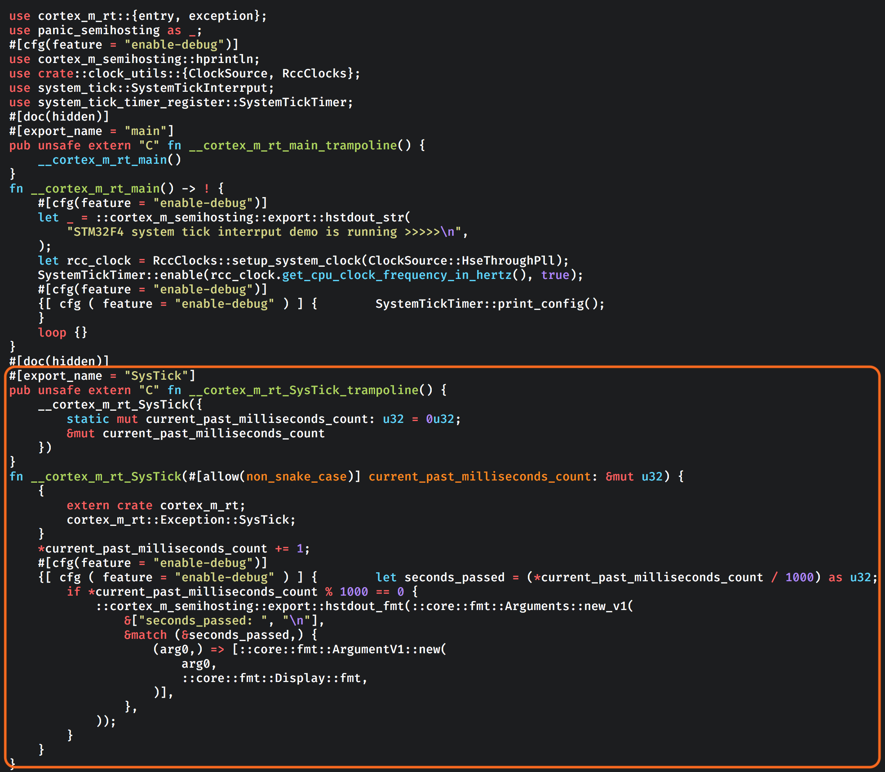
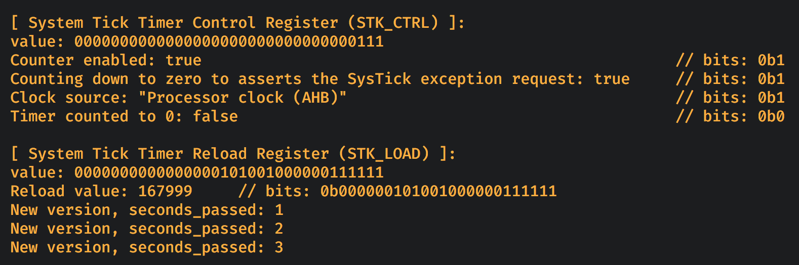

### <a name="how-exception-works">7.3 Let's have close look at how the `SysTick` exception handler function be called</a>

So far, we know the `#[exception]` macro can make a function become an `Exception Handler`,
but how it works under the hood? What's the secret behind that? Let's review the code again:

```rust
#[exception]
fn SysTick() {
    // One feature of the `cortex_m_rt` is that:
    //
    // "Initializing static variables before the program entry point."
    //
    // So the `static mut u32` variable here should be defined before the `entry` and
    // make a `let SAME_NAME_VAR: &mut u32;` here for making the compiler happy to
    // pass the borrow checker.
    //
    // That's why we can use `*SAME_NAME_VAR` to set the static variable below;
    static mut current_past_milliseconds_count: u32 = 0u32;
    //
    *current_past_milliseconds_count += 1;
    //
    #[cfg(feature = "enable-debug")]
    {
        let seconds_passed = (*current_past_milliseconds_count / 1000) as u32;
        if *current_past_milliseconds_count % 1000 == 0 {
            hprintln!("seconds_passed: {}", seconds_passed);
        }
    }
}
```

Even the comment above looks very clear, but we still don't know how that `static mut u32` definition looks like.
So let me introduce the `cargo expand` command. Why we need that? That's because `#[exception]` actually
is a `procedure macro`. If you open this [link](https://docs.rs/cortex-m-rt-macros/0.1.8/src/cortex_m_rt_macros/lib.rs.html#280-500)
you should able to see the source code like below:

```rust
#[proc_macro_attribute]
pub fn exception(args: TokenStream, input: TokenStream) -> TokenStream {
    let mut f = parse_macro_input!(input as ItemFn);

    // Ignore the rest source code.....
}
```
Briefly, a procedure macro will take the source you wrote as the **input**, then do something smart in the implementation, 
for example, implement some `trait` for your `struct`, etc. Then the macro generates back the final source code as the 
**output** which will pipe into the compiler, that's how procedure macro works. 

Let's walk through the steps below before we can run `cargo expand`:

- Install it

    ```bash
    cargo install cargo-expand
    ```

- Because `cargo expand` relies on unstable compiler flags so it requires a `nightly` toolchain to be installed, though does not
require `nightly` to be the default toolchain or the one with which `cargo expand` itself is executed. If the default toolchain 
is one other than `nightly`, running `cargo expand` will find and use `nightly` anyway.

    ```bash
    # Install the essential target to nightly toolchain
    rustup +nightly target add thumbv7em-none-eabi thumbv7em-none-eabihf

    # Double check installed
    rustup +nightly target list | grep installed
    ```

</br>

So, let's run the `cargo expand` and show the secret:

```bash
cargo expand --bin interrupt_system_tick  --features "enable-debug use-stm32f407g-disc1"
```

It prints a lot, but we only focus on the bottom part like below:



</br>

Let's only focus on the highlighted part and make it simple like below:

```rust
#[export_name = "SysTick"]
pub unsafe extern "C" fn __cortex_m_rt_SysTick_trampoline() {
    __cortex_m_rt_SysTick({
        static mut YOUR_STATIC_VAR_NAME_HERE: u32 = 0u32;
        &mut YOUR_STATIC_VAR_NAME_HERE
    })
}
fn __cortex_m_rt_SysTick(#[allow(non_snake_case)] YOUR_STATIC_VAR_NAME_HERE: &mut u32) {
    {
        extern crate cortex_m_rt;
        cortex_m_rt::Exception::SysTick;
    }
    *YOUR_STATIC_VAR_NAME_HERE += 1;

    // Ignore the non-important part
}
```

What information we got from the code above?

- `SysTick` is the `Exception Handler` (function name) which defined in the **`Vector Table`** we saw in chapter **7.1**.

- `__cortex_m_rt_EXCEPTION_NAME_trampoline` extern function will call the `__cortex_m_rt_EXCEPTION_NAME` function
and pass in the static variable definition block when calling it.

</br>

That's it, it looks simple.

By the way, do you figure out what you need to do if you want to call a specific `ISR` (Interrupt Service Routine)?
Is it just replace the `EXCEPTION_NAME` to the `IRQ_NUMBER` like (`IRQ2`, `IRQ3`)? I leave it to you to figure out:)

Two more things:

- For the complicated function name `__cortex_m_rt_EXCEPTION_NAME_trampoline` and `__cortex_m_rt_EXCEPTION_NAME` is that necessary?
The answer is **NO**, you can replace to whatever name you want, as the `#[export_name = "EXCEPTION_NAME"]` attribute is the place 
to declare what exception handler function name you're dealing with.

- If you don't familiar with the `extern` keyword or why it needs to be `unsafe`, 
here are the links can help you:

    - [Keyword `extern`](https://doc.rust-lang.org/std/keyword.extern.html)

    - [`extern` reference](https://doc.rust-lang.org/reference/items/external-blocks.html), please read the `function` and `statics` section.

</br>

So finally, we figured out the pattern for calling the particular `Exception Handler` without using the `#[exception]` procedure macro:

- If you want to use `static` variable:

    ```rust
    #[export_name = "EXCEPTION_NAME"]
    pub unsafe extern "C" fn EXCEPTION_NAME_handler_wrapper() {
        EXCEPTION_NAME_handler({
            static mut YOUR_STATIC_VAR_NAME_HERE: TYPE_HERE = VAR_INIT_VALUE_HERE;
            &mut YOUR_STATIC_VAR_NAME_HERE
        })
    }

    fn EXCEPTION_NAME_handler(#[allow(non_snake_case)] YOUR_STATIC_VAR_NAME_HERE: &mut TYPE_HERE) {
        // Your handler code here
    }
    ```

- If you don't need the static variable:
    ```rust
    #[export_name = "EXCEPTION_NAME"]
    pub unsafe extern "C" fn EXCEPTION_NAME_handler_wrapper() {
        EXCEPTION_NAME_handler()
    }

    fn EXCEPTION_NAME_handler() {
        // Your handler code here
    }
    ```

</br>

Here is the new version to replace the `#[exception]` macro one:

```rust
#[export_name = "SysTick"]
pub unsafe extern "C" fn system_tick_exception_handler_wrapper() {
    system_tick_exception_handler({
        static mut current_past_milliseconds_count: u32 = 0u32;
        &mut current_past_milliseconds_count
    })
}

fn system_tick_exception_handler(
    #[allow(non_snake_case)] current_past_milliseconds_count: &mut u32,
) {
    *current_past_milliseconds_count += 1;
    //
    #[cfg(feature = "enable-debug")]
    {
        let seconds_passed = (*current_past_milliseconds_count / 1000) as u32;
        if *current_past_milliseconds_count % 1000 == 0 {
            hprintln!("New version, seconds_passed: {}", seconds_passed);
        }
    }
}
```

Full version is here: [demo/src/bin/interrupt_system_tick_new_version.rs](https://github.com/wisonye/rust-embedded-with-stm32f4/blob/master/demo/src/bin/interrupt_system_tick_new_version.rs)

Let's build a production version (no `enable-debug` feature) to see what we got:

```bash
cargo clean
cargo-strip --target thumbv7em-none-eabi --bin interrupt_system_tick_new_version --features "use-stm32f407g-disc1" --release --verbose
```
We got the very small size binary: `8.5K interrupt_system_tick_new_version*`

Then, let's put back the `enable-debug` feature and run it again:

```bash
cargo clean
cargo-strip --target thumbv7em-none-eabi --bin interrupt_system_tick_new_version --features "enable-debug use-stm32f407g-disc1" --release --verbose

# Run it in qemu
qemu-system-gnuarmeclipse -cpu cortex-m4 -mcu STM32F407VG -machine STM32F4-Discovery -semihosting-config enable=on,target=native -kernel target/thumbv7em-non
e-eabi/release/interrupt_system_tick_new_version
```

It works as expected:



</br>

