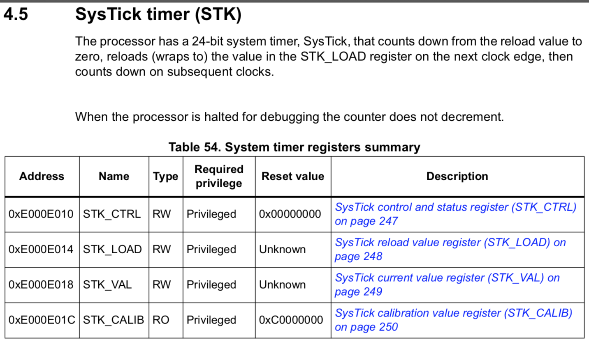
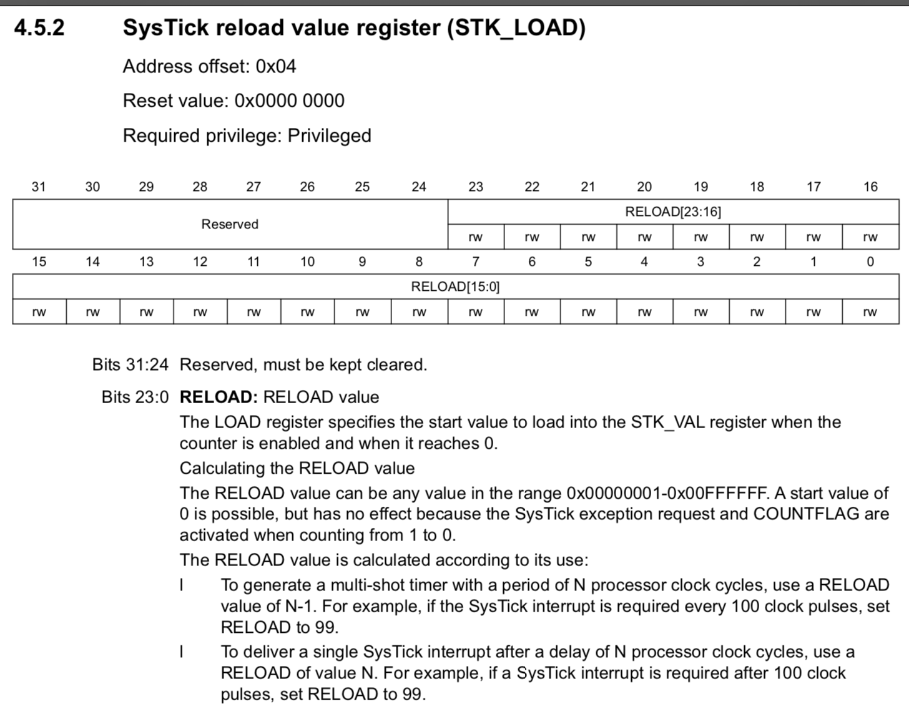
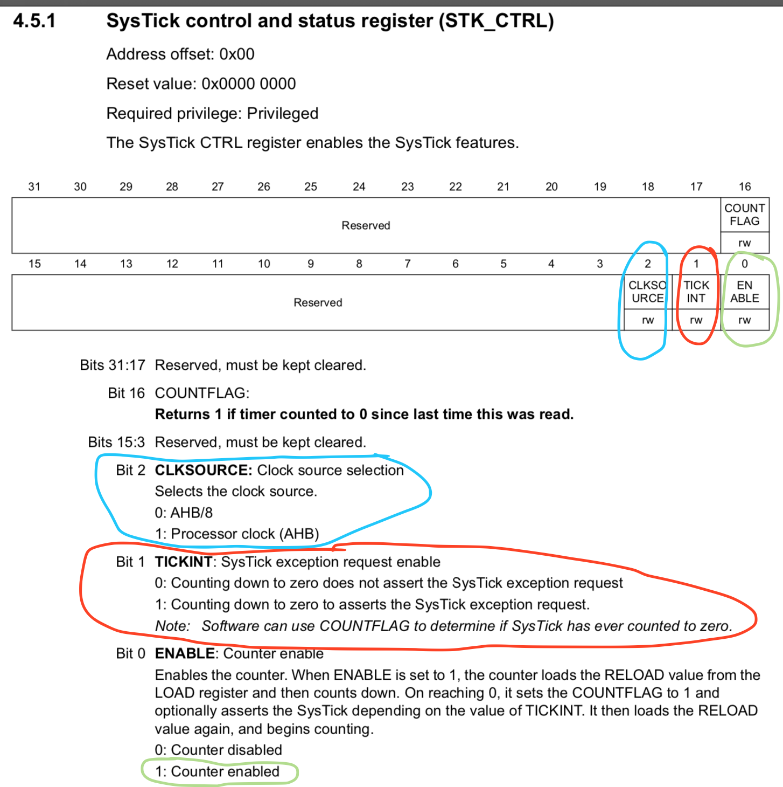
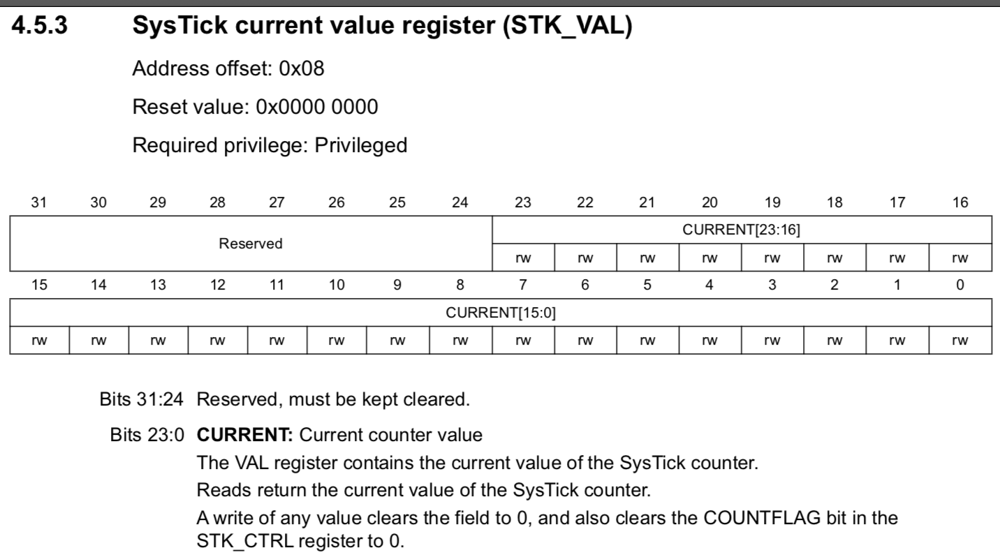

### <a name="how-exception-works">7.2 Let's handle the `SysTick` exception</a>

The quick brief of `SysTick`:

We've already learned the `clock` in previous chapters, then we know that after selecting and applying the `clock source`, 
the CPU clock runs in the expected frequency just like a pulse to drive all peripherals and components. 

For example, if the
`HCLK` frequency is `168MHz`, that means _**168,000,000**_ system ticks happen per second. There are four registers below related to
the `SysTick`:



That's in the [stm32-cortexm4-mcus-and-mpus-programming-manual.pdf](https://github.com/wisonye/rust-embedded-with-stm32f4/blob/master/stm32-cortexm4-mcus-and-mpus-programming-manual.pdf) page 246.

- `STK_CTRL`:

    It controls enable or disable the system tick timer functionality and generate `SysTick` event.

- `STK_LOAD`:

    It defines the `Reload Value` which `STK_VAL` register used to countdown from that value to zero.

- `STK_VAL`:

    It holds the current countdown value, this value minus 1 per system tick cycle. After the countdown to 0. 
    Two things will happen:

    - The `bit16` in `STK_CTRL` will auto flip to `1` which represents finish a one-trip countdown from 
    `Reload Value` to `0.` This bit will be reset to `0` after reading from `STK_CTRL` to make sure
    the even only happens once.

    - One `SysTick` event will be generated and the `SysTick` exception handler gets called (if defined that function).

</br>

For generating the `SysTick` (event) per millisecond, here are the steps:

1. Calculate the total system ticks amount for 1 millisecond, then set that value to `STK_LOAD` register:

    `(cpu_clock_frequency_in_hertz / 1000) - 1`

    

    Because the `STK_LOAD` register only got 24 bit to save the current countdown value which means you can't set it too big,
    as that will cause overflow.

2. Set the correct clock source to `STK_CTRL` register `bit2` and set `bit1` to `1` if you want to generate the `SysTick` exception:


    

3. Reset the `STK_VAL` register value to `0`.

    

4. Enable the countdown by setting `1` to `STK_CTRL` register `bit0`, then timer starts
   to countdown and will set `STK_CTRL` register `bit16` to `1` when countdown to 0.

</br>


- `SysTick` timer register util is here:

    - [demo/src/register_utils/system_tick_timer_register.rs](https://github.com/wisonye/rust-embedded-with-stm32f4/blob/master/demo/src/register_utils/system_tick_timer_register.rs)

- Create [`demo/src/bin/interrupt_system_tick.rs`](https://github.com/wisonye/rust-embedded-with-stm32f4/blob/master/demo/src/bin/interrupt_system_tick.rs) with the following code:

    ```rust
    #![allow(warnings)]
    #![no_std]
    #![no_main]
    
    #[path = "../clock_frequency.rs"]
    mod clock_frequency;
    #[path = "../clock_utils.rs"]
    mod clock_utils;
    #[path = "../register_utils/flash_access_control_register.rs"]
    mod flash_access_control_register;
    #[path = "../register_utils/rcc_clock_config_register.rs"]
    mod rcc_clock_config_register;
    #[path = "../register_utils/rcc_clock_control_register.rs"]
    mod rcc_clock_control_register;
    #[path = "../rcc_clock_settings.rs"]
    mod rcc_clock_settings;
    #[path = "../register_utils/rcc_pll_config_register.rs"]
    mod rcc_pll_config_register;
    #[path = "../interrupt_utils/system_tick.rs"]
    mod system_tick;
    #[path = "../register_utils/system_tick_timer_register.rs"]
    mod system_tick_timer_register;
    
    use cortex_m_rt::{entry, exception};
    use panic_semihosting as _;
    
    #[cfg(feature = "enable-debug")]
    use cortex_m_semihosting::hprintln;
    
    use crate::clock_utils::{ClockSource, RccClocks};
    use system_tick::SystemTickInterrput;
    use system_tick_timer_register::SystemTickTimer;
    
    #[entry]
    fn main() -> ! {
        #[cfg(feature = "enable-debug")]
        let _ = hprintln!("STM32F4 system tick interrput demo is running >>>>>");
    
        let rcc_clock = RccClocks::setup_system_clock(ClockSource::HseThroughPll);
        SystemTickTimer::enable(rcc_clock.get_cpu_clock_frequency_in_hertz(), true);
    
        #[cfg(feature = "enable-debug")]
        {
            // RccClocks::print_system_clock_info();
            SystemTickTimer::print_config();
        }
    
        loop {}
    }
    
    #[exception]
    fn SysTick() {
        // One feature of the `cortex_m_rt` is that:
        //
        // "Initializing static variables before the program entry point."
        //
        // So the `static mut u32` variable here should be defined before the `entry` and
        // make a `let SAME_NAME_VAR: &mut u32;` here for making the compiler happy to
        // pass the borrow checker.
        //
        // That's why we can use `*SAME_NAME_VAR` to set the static variable below;
        static mut current_past_milliseconds_count: u32 = 0u32;
    
        *current_past_milliseconds_count += 1;
    
        #[cfg(feature = "enable-debug")]
        {
            let seconds_passed = (*current_past_milliseconds_count / 1000) as u32;
            if *current_past_milliseconds_count % 1000 == 0 {
                hprintln!("seconds_passed: {}", seconds_passed);
            }
        }
    }
    ```

- How to run

    ```rust
    // cd demo
    cargo watch -c --exec 'run --bin interrupt_system_tick --features "enable-debug use-stm32f407g-disc1"'
    ```
