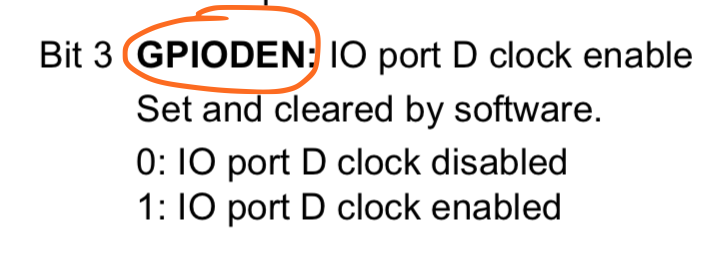
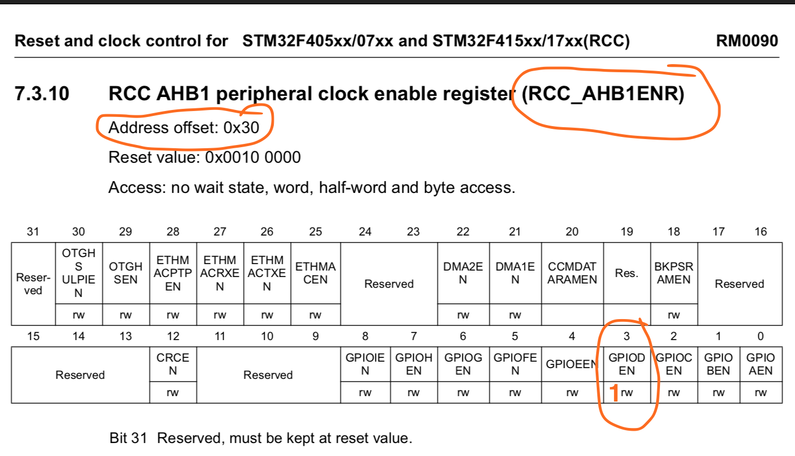
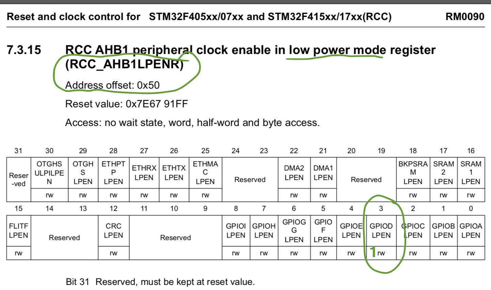
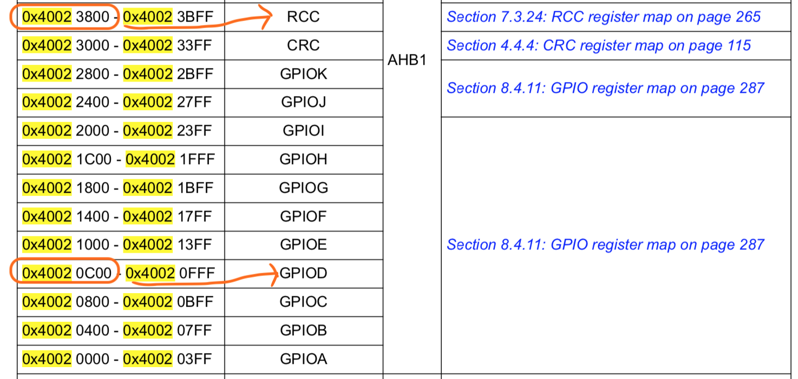

#### <a name="how-to-enable-gpio-d">5.3.1 How to enable the `GPIO` port `D`</a>

When you first turn on the `MCU`, everything turns off for power saving. We need to enable the **GPIOD**.
And here are the tips: 

- Search `gpioded` which stands for "gpiod enable" in the [`reference manual`](https://github.com/wisonye/rust-embedded-with-stm32f4/blob/master/stm32f4-reference-manual.pdf), then we got this at page 243:

    

    <hr>

    _Then scroll up to the page 242:_

    <hr>

    

    <hr>

    _also, we got the low power mode setting at page 250 as well:_

    <hr>

    

    <hr>

    So what information we got here?
    
    - **GPIOD** connects to **AHB1** bus
    - There is an **RCC_AHB1ENR** register responsible for enabling the **GPIOD**
    - We need to set the **RCC_AHB1ENR** register `bit3` to `1`, then **GPIOD** will be enabled.
    - The **RCC_AHB1ENR** register memory address offset is **0x30**
    
    </br>

    We got a register address _offset_, then what is the address _base_? Keep searching `boundary address`, so we got it in page 65:
    
    
    
    That means the **RCC_AHB1ENR** register memory address will be **0x40023800 + 0x30** which is **0x40023830**.
    
    ###### _**RCC** stand for **Reset and Clock Control**_
    
    There is an **RCC register map** table in [`reference manual`](https://github.com/wisonye/rust-embedded-with-stm32f4/blob/master/stm32f4-reference-manual.pdf) page 265 as well.

    </br>

- Then we're able to write `rust` code to enable the **GPIOD** like below:

    ```rust
    const RCC_REGISTER: u32 = 0x40023800;
    const RCC_AHB1ENR_REGISTER: u32 = RCC_REGISTER + 0x30; // page 242, 243
    const RCC_AHB1LPENR_REGISTER: u32 = RCC_REGISTER + 0x50; // Low power (sleep) mode, page 250, 252,
    unsafe {
        // Enable `GPIOD` by setting the `bit3` to `1` for both registers.
        *(RCC_AHB1ENR_REGISTER as *mut u32) = 1 << 3;
        *(RCC_AHB1LPENR_REGISTER as *mut u32) = 1 << 3;
    }
    ```
