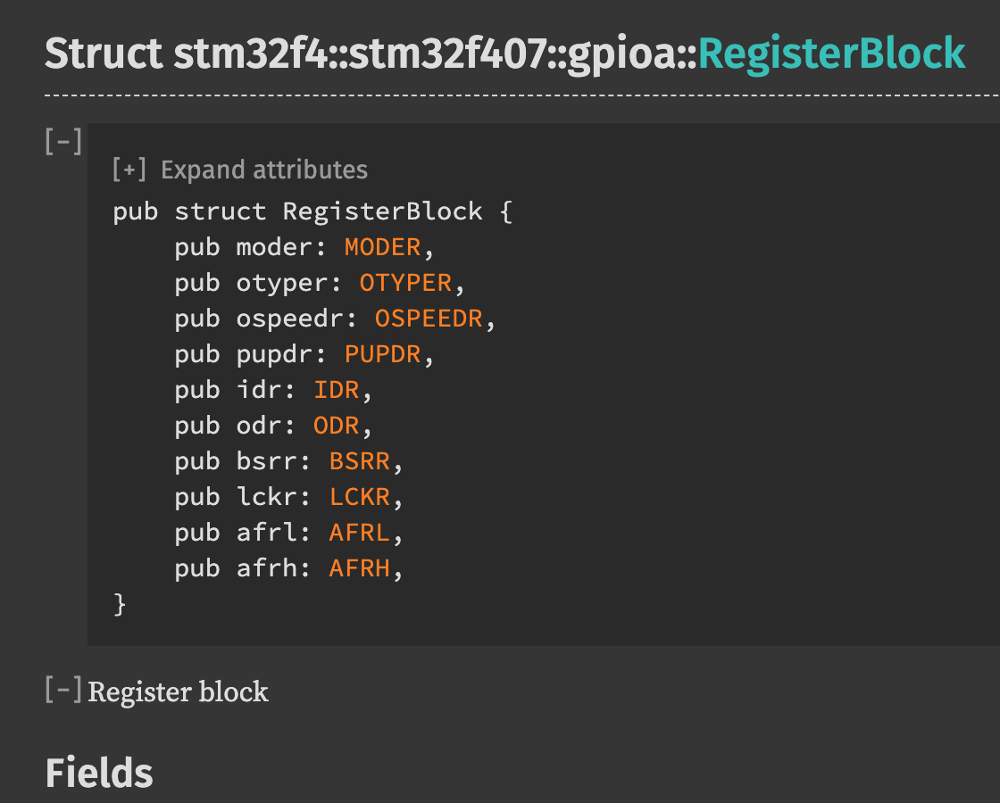
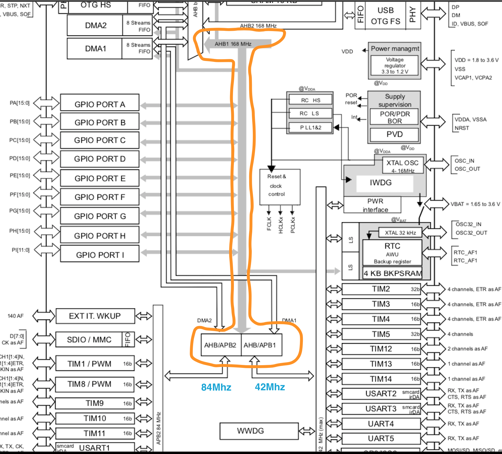

### <a name="mcu-register">5.1 About STM32F4 MCU registers</a>

A register is a special region of memory that controls a **peripheral**. 
A **peripheral** is a piece of electronics that sits right next to the processor within the microcontroller package and provides the processor with extra functionality. 
After all, the processor, on its own, can only do math and logic.
There are couples of supported peripherals inside the `STM32F4 MCU`:

- GPIO
- I2C
- SPI
- USART
- RCC
- ....etc

Why we use `MCU`? The usual reason is that: Want to control the external peripherals (some kind of sensors, robot arms, motors, etc).
So the question is How you can control the external peripherals? The answer is via the **peripheral register** inside the `MCU`.
Each peripheral includes a couple of registers which call `RegisterBlock` in `stm32f` PAC (Peripheral Access Crate) or HAL (Hardware Abstraction Layer Crate) like below:

If you have no idea about what those registers for, just leave it at this moment, we will get into the detail later.

But before dive into the **GPIO** register, let's take a look at how those peripherals are connected. Below is the `STM32F4 block diagram` in [`datasheet`](./stm32f407vg-datasheet.pdf) (page 19):

As you can see, the orange highlighted part is the system bus, all supported peripherals connected onto it:

- **AHB1** can up to **168Mhz** (`STM32F407VG` for example)
- **AHB1** separated into 2 extra bus for connecting to different peripherals:
    - **AHB1/APB2** is high speed which can up to **84Mhz**
    - **AHB1/APB1** is low speed which can up to **42Mhz**

Ok, so we got enough basic knowledge for the peripheral registers, let's pick the **GPIO registers** as the experimental case and write some low-level code to control the **GPIO register** to turn-on and turn-off the onboard LEDs.
