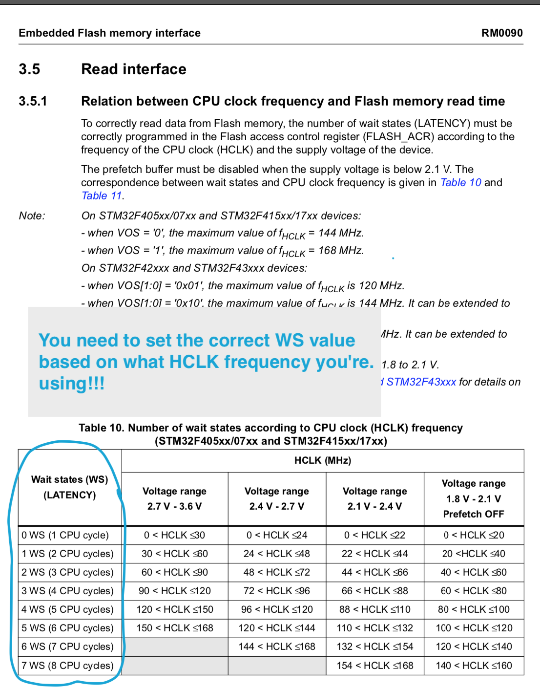
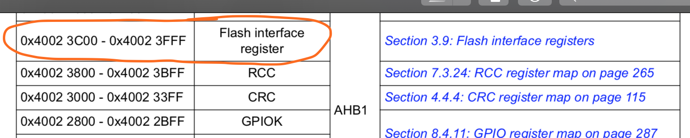
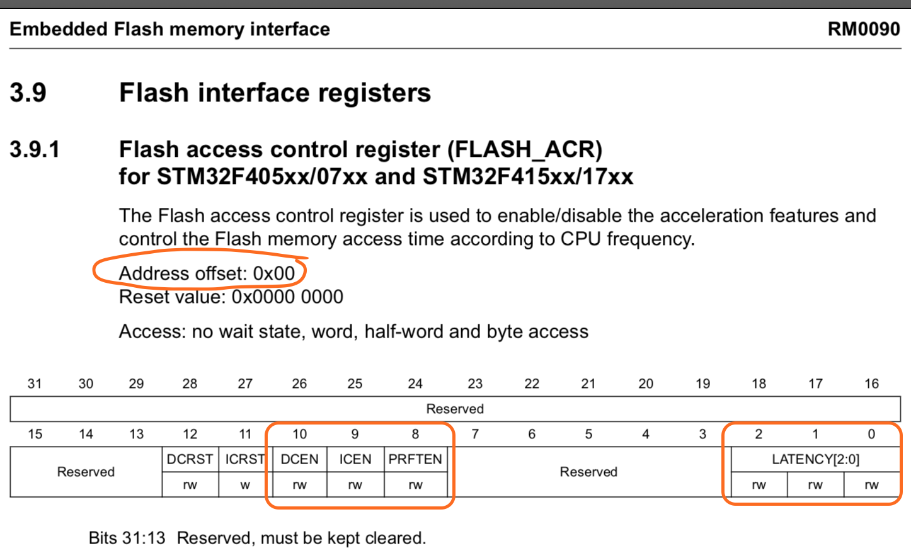
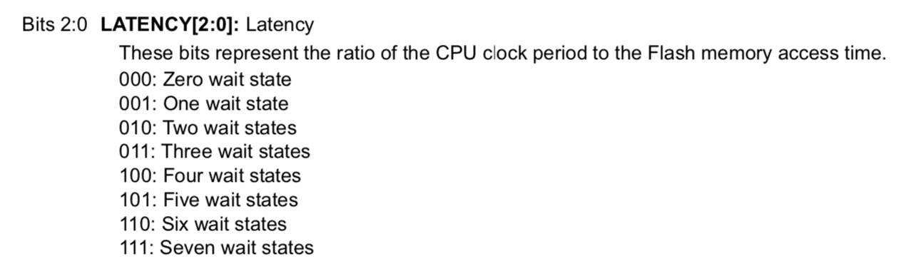
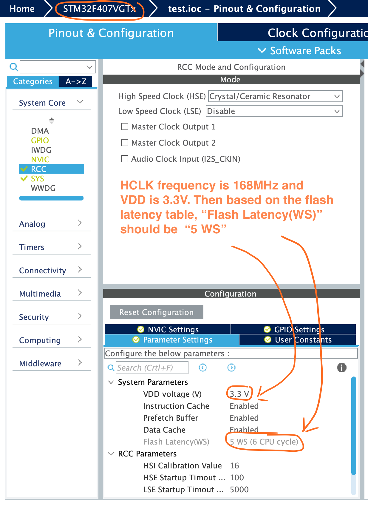
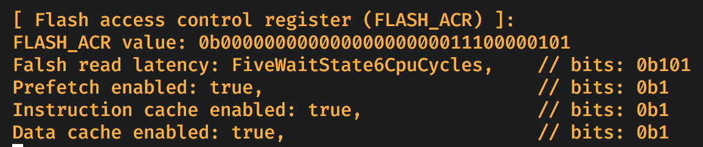

#### <a name="flash_acr">6.6.3 Flash access control register (`FLASH_ACR`)</a>

[`reference manual`](https://github.com/wisonye/rust-embedded-with-stm32f4/blob/master/stm32f4-reference-manual.pdf) page 80:

First thing first, we need to know _Why we have to set this flash prefetch latency_?

The explanation above is the answer: _**There is a special relation between CPU clock frequency and Flash memory read time**_.

Then we have to make it right after we change the **`HCLK`** frequency!!!

 

So, here is the register info in page 65 and 98:

What information we got from this diagram?

- `bit0 ~ bit2` controls the flash prefetch latency setting:

    

    Tips for picking the correct latency value:

    _After you changed the **`HCLK`** frequency in `STMCubeMX` UI,
    back to the `Pinout & Configuration` tab, click on `RCC` on the left side, then you're able to see the correct latency
    setting for the particular frequency like below:_

    

- `bit8` needs to set to `1` for enabling the prefetch.

- `bit9` needs to set to `1` for enabling the instruction cache.

- `bit10` needs to set to `1` for enabling the data cache.

 

Here is the source: [demo/src/register_utils/flash_access_control_register.rs](https://github.com/wisonye/rust-embedded-with-stm32f4/blob/master/demo/src/register_utils/flash_access_control_register.rs)

When the final demo runs, the `FLASH_ACR` register debug info will look like below:

