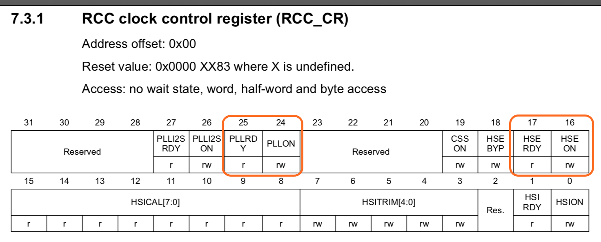
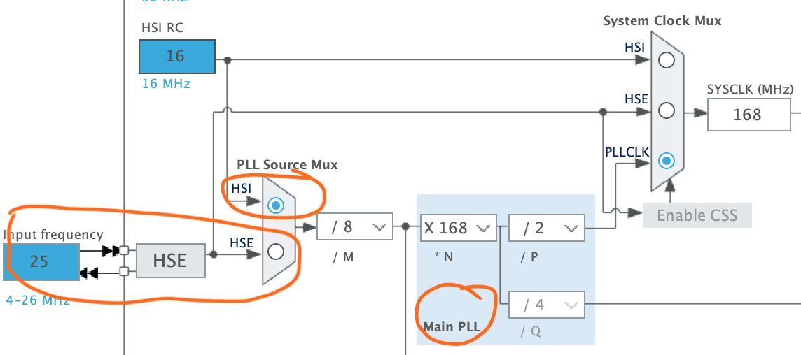
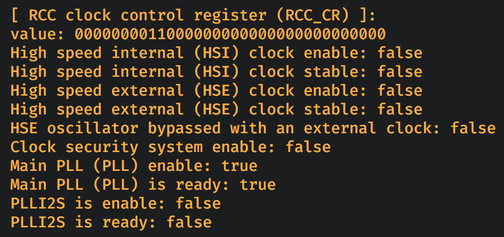

#### <a name="rcc_cr">6.6.1 RCC clock control register (`RCC_CR`)</a>

[`reference manual`](https://github.com/wisonye/rust-embedded-with-stm32f4/blob/master/stm32f4-reference-manual.pdf) page 224:

What information we got from this diagram?

- `bit0` means use **`HSI`** as clock source, `bit1` means **`HSI`** is stable. These 2 bites will set to `1` after power on, as **`HSI`** is the default clock source.

- `bit16` need to set to `1` if you decide to use **`HSE`** as clock source. After setting `bit16` to `1`, you should wait for `bit17` become `1` which means **`HSE`** is stable.

- `bit24` need to set to `1` if you decide to use **`HSI`** or **`HSE`** through **`PLL`** as clock source. After setting `bit24` to `1`, you should wait for `bit25` become `1` which means **`PLL`** is stable.

- Also, keep in mind that you should finish setting **`PLL`** factors before you set `bit24` (**`PLL`**) to `1`, as you can't set **`PLL`** factors after **`PLL`** is on!!!

 

It's all about the highlighted settings in the diagram below:

 

Here is the source: [demo/src/register_utils/rcc_clock_control_register.rs](https://github.com/wisonye/rust-embedded-with-stm32f4/blob/master/demo/src/register_utils/rcc_clock_control_register.rs)

When the final demo runs, the `RCC_CR` register debug info will look like below:

