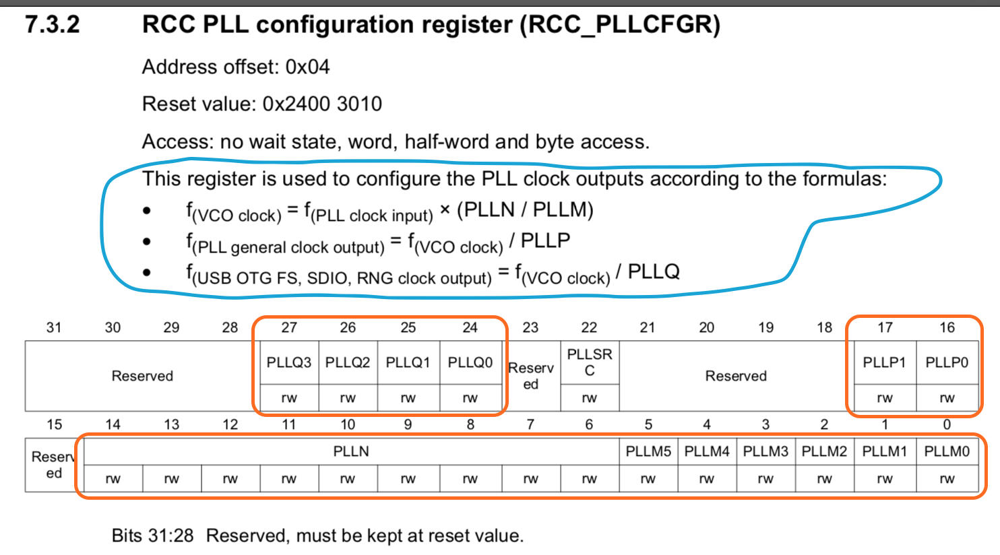
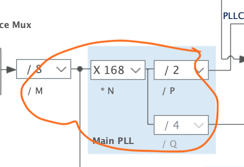
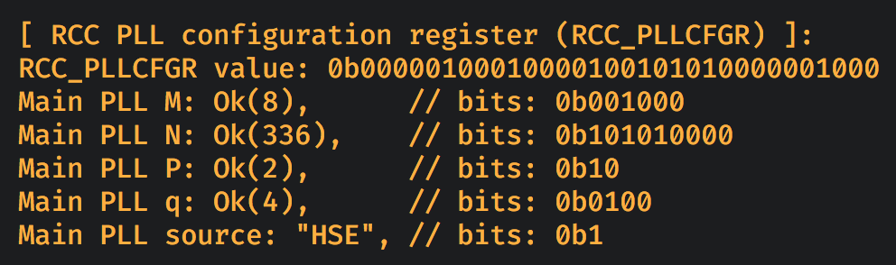

#### <a name="rcc_cfgr">6.6.4 RCC PLL configuration register (`RCC_PLLCFGR`)</a>

[`reference manual`](https://github.com/wisonye/rust-embedded-with-stm32f4/blob/master/stm32f4-reference-manual.pdf) page 226:

What information we got from this diagram?

- `bit0 ~ bit5` controls the `PLL M` factor.

- `bit6 ~ bit14` controls the `PLL N` factor.

- `bit16 ~ bit17` controls the `PLL P` factor.

- `bit24 ~ bit27` controls the `PLL Q` factor.

 

It's all about the highlighted settings in the diagram below:

 

Here is the source: [demo/src/register_utils/rcc_pll_config_register.rs](https://github.com/wisonye/rust-embedded-with-stm32f4/blob/master/demo/src/register_utils/rcc_pll_config_register.rs)

When the final demo runs, the `RCC_CFGR` register debug info will look like below:

